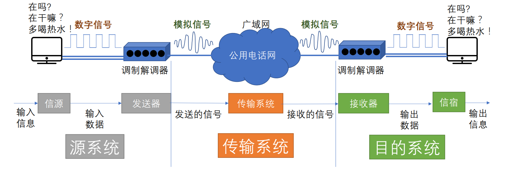
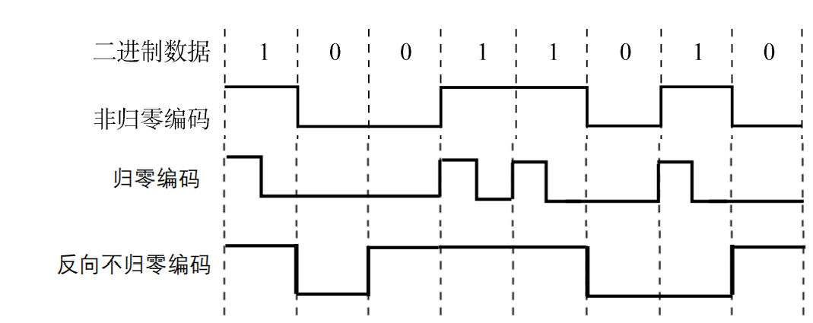
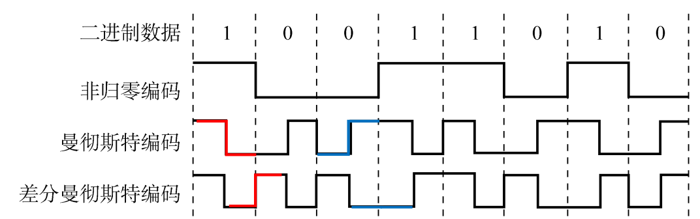
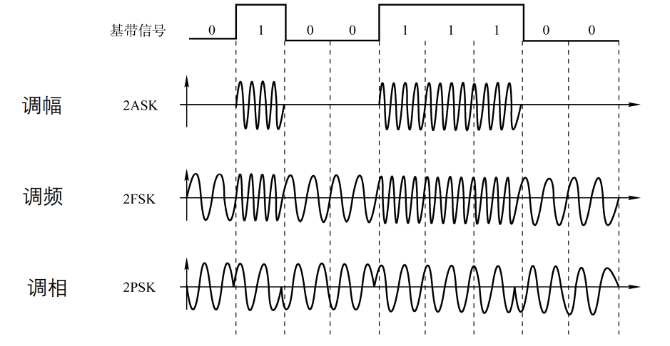
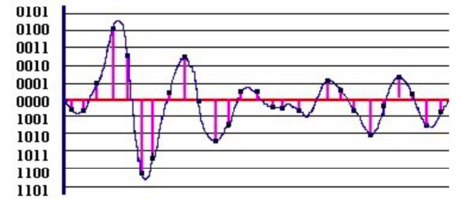
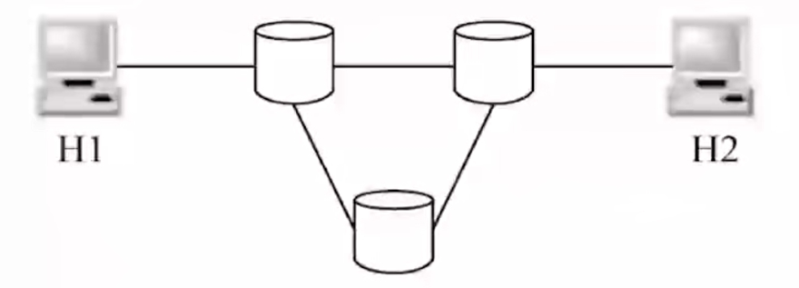

# 2.1 通信基础

## 2.1.1 基本概念

### 1、物理层的接口特性

物理层的主要任务：确定与传输媒体<mark style="color:orange;">**接口**</mark>有关的一些特性

* **机械特性**
  * 规格
  * 接口形状
  * 引脚数目、排列情况
* **电气特性**
  * 工作电压
  * 阻抗匹配
  * 传输速率
  * 距离限制
* **功能特性**
  * 引脚高低电平含义
  * 接口信号线的用途
* **规程特性**
  * 定义与过程、时序相关的关系

### 2、相关术语

**数据**：传送信息的实体，通常是有意义的符号序列

**信号**：数据的电气/电磁的表现，是数据在传输过程中的<mark style="color:red;">**存在形式**</mark>

* **数字信号/离散信号**：代表消息的参数的取值是<mark style="color:orange;">**离散**</mark>的
* **模拟信号/连续信号**：代表消息的参数的取值是<mark style="color:orange;">**连续**</mark>的

**信源**：产生和发送数据的源头

**信宿**：接收数据的终点

**信道**：信号的传输媒介。<mark style="color:orange;">**信道是有方向性的**</mark>，因此一条通信线路往往包含一条发送信道和一条接收信道

**信道的分类：**

* 按照传输信号
  * 模拟信道
  * 数字信道
* 按照传输介质
  * 无线信道
  * 有线信道

#### **码元**

码元是指用一个<mark style="color:orange;">**固定时长**</mark>的<mark style="color:purple;">**信号波形**</mark>（数字脉冲），代表不同离散数值的基本波形，是数字通信中数字信号的计量单位。

这个固定时长内的信号称为k进制码元，而该时长称为码元宽度。当码元的离散状态有M个时（M大于2），该码元为M进制码元。

**1码元可以携带多个比特的信息量**。例如，在使用二进制编码时，只有两种不同的码元，一种代表0状态，另一种代表1状态。

#### 带宽

在**模拟信号系统**中，最高频率和最低频率间的差值就代表了系统的带宽，单位为赫兹（Hz）。

**数字设备**中，表示在<mark style="color:orange;">**单位时间**</mark>内从网络中的某一点到另一点所能通过的<mark style="color:orange;">**最高数据率**</mark>/单位时间内通过链路的数量，常用来表示网络的通信线路所能传输数据的能力。单位是<mark style="color:red;">**比特每秒（bps）**</mark>。

### 3、三种通信方式

#### （1）单工通信

只有一个方向的通信而没有反方向的交互，仅需要<mark style="color:orange;">**一条**</mark>信道。

#### （2）半双工通信/双向交替通信

通信的双方都可以发送或接收信息，但任何一方都不能同时发送和接收， 需要<mark style="color:orange;">**两条**</mark>信道。

#### （3）全双工通信/双向同时通信

通信双方可以<mark style="color:orange;">**同时**</mark>发送和接受信息，也需要<mark style="color:orange;">**两条**</mark>信道。

### 4、串行传输和并行传输

**串行传输**：将表示一个字符的8位二进制数按由低位到高位的顺序<mark style="color:orange;">**依次发送**</mark>。

* 速度慢
* 费用低
* 适合远距离传输

**并行传输**：将表示一个字符的8位二进制数<mark style="color:orange;">**同时**</mark>通过8条信道发送。

* 速度快
* 费用高
* 适合近距离传输

### 5、同步传输和异步传输

**同步传输**：在同步传输的模式下，数据的传送是以一个<mark style="color:purple;">**数据区块**</mark>为单位，因此同步传输又称为区块传输。 在传送数据时，需先送出1个或多个<mark style="color:purple;">**同步字符**</mark>，再送出<mark style="color:orange;">**整批的数据**</mark>。

**异步传输**：异步传输将比特分成小组进行传送，小组可以是8位的1个字符或更长。发送方可以在<mark style="color:orange;">**任何时刻**</mark>发送这些比特组，而接收方不知道它们会在什么时候到达。传送数据时，加一个字符<mark style="color:purple;">**起始位**</mark>和一一个<mark style="color:purple;">**字符终止位**</mark>。

### 6、数据传输速率的表示

速率也叫数据率，是指数据的**传输速率**，表示单位时间内传输的数据量。

#### （1）码元传输速率

别名码元速率、波形速率、调制速率、符号速率等，它表示<mark style="color:orange;">**单位时间内**</mark>数字通信系统所传输的<mark style="color:purple;">**码元个数**</mark>（也可称为脉冲个数或信号变化的次数），单位是波特（Baud）。


由一个低电平到另一个低电平也算一次信号变化，因为从一个码元变到了另一个。


#### （2）信息传输速率

别名信息速率、比特率等，表示<mark style="color:orange;">**单位时间内**</mark>数字通信系统传输的二进制码元个数（即<mark style="color:purple;">**比特数**</mark>），单位是比特/秒（b/s）。
$$
\begin{align}
\text{bit/s} &= \text{Baud} \times \log_2n\\
&= 采样频率 \times 信号携带的比特数
\end{align}
$$

## 2.1.2 奈氏定理与香农定理

### 1、失真

影响失真程度的因素：

* 码元传输速率
* 信号传输距离
* 噪声干扰
* 传输媒体质量

**码间串扰**：接收端收到的信号波形由于频率太高，<mark style="color:orange;">**失去了码元之间清晰界限**</mark>的现象。

### 2、奈奎斯特定理

在理想低通（无噪声，带宽受限）条件下，为了避免码间串扰，极限<mark style="color:orange;">**码元传输速率**</mark>为<mark style="color:purple;">**2W Baud**</mark>。

* W是信道带宽，单位是Hz。

极限数据率：

$$
理想低通环境下的极限数据传输率=2w \log_{2}V \quad(b/s)
$$

* V：码元的形态（0、1两种；0、1、2、3四种等）

#### 结论

* 在任何信道中，<mark style="color:orange;">**码元传输的速率是有上限的**</mark>。若传输速率超过此上限，就会出现严重的码间串扰问题
* 信道的频带越宽（即能通过的信号高频分量越多），就可以用更高的速率进行码元的有效传输
* 奈氏准则<mark style="color:orange;">**给出了码元传输速率的限制，但并没有对信息传输速率给出限制**</mark>
* 由于码元的传输速率受奈氏准则的制约，所以要提高数据的传输速率，就必须设法使每个码元能携带更多个比特的 信息量，这就需要采用多元制的调制方法


例：在无噪声的情况下,若某通信链路的带宽为3kHz，采用4个相位，每个相位具有4种振幅的QAM调制技术，则该通信链路的最大数据传输率是多少?

V=4\*4=16

W=3\*10^3

$$2\times 3\times 10^3 \times \log_{2}16=24\ \text{kb/s}$$


### 3、香农定理

**噪声**存在于所有的电子设备和通信信道中。由于噪声随机产生，它的瞬时值有时会很大，因此噪声会使接收端对码t元的判决产生错误。但是噪声的影响是相对的，若信号较强，那么噪声影响相对较小。

$$
信道的极限数据传输率=W \log_{2}(1+\frac{S}{N}) \quad(b/s)
$$

* W：信道带宽，单位为赫兹（Hz）
* S/N：信噪比，信号强度与噪音的比值，也可以以分贝（dB）为单位表示，公式如下：

$$
信噪比(dB) = 10\log_{10}\frac{S}{N}
$$

#### 结论

* 信道的带宽或信道中的信噪比越大，则信息的极限传输速率就越高
* 对一定的传输带宽和一定的信噪比，信息传输速率的上限就确定了
* 只要信息的传输速率低于信道的极限传输速率，就一定能找到某种方法来实现<mark style="color:orange;">**无差错的传输**</mark>
* 香农定理得出的为极限信息传输速率，实际信道能达到的传输速率要比它低不少


例：电话系统的典型参数是信道带宽为3000Hz，信噪比为30dB，则该系统最大数据传输速率是多少?

$$30(dB) = 10\log_{10}\frac{S}{N}$$&#x20;

$$\frac{S}{N} = 1000$$&#x20;

$$信道的极限数据传输速率=W\log_{2}(1+\frac{S}{N}) = 3000\times\log_{2}(1+1000)\approx 30\ (kb/s)$$


### 4、奈氏准则和香农定理的选择

* 奈氏准则
  * 在<mark style="color:orange;">**无噪声**</mark>环境下，为了避免<mark style="color:purple;">**码间串扰**</mark>
  * 限制码元的传输速率
  * 提高效率的方法是提高带宽、采用更好的编码技术（一个码元表示多个比特）
* 香农定理
  * 在<mark style="color:orange;">**有噪声**</mark>条件下的信息传输速率
  * 提高效率的方法是提高信噪比和带宽

## 2.1.3 编码与调制

**基带信号**：将数字信号1和0直接用两种不同的电压表示，再送到<mark style="color:orange;">**数字信道**</mark>上去传输（<mark style="color:purple;">**基带传输**</mark>）

**宽带信号**：将基带信号进行调制后形成的频分复用模拟信号，再传送到<mark style="color:orange;">**模拟信道**</mark>上去传输（<mark style="color:purple;">**宽带传输**</mark>）

* 在传输距离<mark style="color:orange;">**较近**</mark>时，计算机网络采用<mark style="color:purple;">**基带传输**</mark>方式
  * 直接传输数字信号
* 在传输距离<mark style="color:orange;">**较远**</mark>时，计算机网络采用<mark style="color:purple;">**宽带传输**</mark>方式
  * 将基带信号经过**载波调制**后，把信号的频率范围搬移到**较高的频段**以便在信道中传输

**编码**：将数据处理为数字信号

**调制**：将数据处理为模拟信号

### 1、数字数据编码为数字信号

使用设备为<mark style="color:purple;">**数字发送器**</mark>。

#### （1）非归零编码、归零编码、反向不归零编码

* **非归零编码（NRZ）**：高1低0
  * 容易实现
  * 双方难以保持同步，需要额外信道传输时钟周期信号
* **归零编码（RZ）**：高1低0，且信号电平在一个码元之内都要恢复到零
  * 信道利用率低
* 反向不归零编码（NRZI）：信号电平翻转表示0，不变表示1
  * 缺点同非归零编码

#### （2）曼彻斯特编码和差分曼彻斯特编码

* **曼彻斯特编码**：前高后低为1，前低后高为0
  * 信号中间的跳变既可用于传送数据，同时也传送了时钟周期信号
  * 所占的频带宽度是原始的基带宽度的两倍，<mark style="color:orange;">**数据传输速率只有调制速率的1/2**</mark>
* **差分曼彻斯特编码**：与上一个码元后半段电平比较，变化为0，不变为1
  * 可以实现自同步
  * 抗干扰性强

#### （3）4B/5B编码

在4位比特流开头插入额外的一位0或1用于分割一长串的0、1信号。

编码效率为80%

### 2、数字信号调制为模拟信号

使用设备为<mark style="color:purple;">**调制器**</mark>。

三种调制方式：

- 幅移键控（ASK）
- 频移键控（FSK）
- 相移键控（PSK）

此外，还有将调幅和调相结合起来的**正交振幅调制（QMA）**

- 波特率B
- 相位数m
- 振幅数n

$$
QAM数据传输率=\text{B} \log_2 (mn)
$$


例：某通信链路的波特率是1200Baud，采用4个相位，每个相位有4种振幅的QAM调制技术，则 该链路的信息传输速率是多少?

&#x20;码元种类=4X4=16

每个码元所包含的比特位：$$\log_{2}16=4\ \text{(bit)}$$

1200Baud = 1200 X 4 = 4800 bit/s


### 3、模拟信号编码为数字信号

使用设备为<mark style="color:purple;">**PCM编码器**</mark>。

- PCM：**脉码调制**，常用于音频信号处理

编码的过程：

1. **抽样**：对模拟信号周期性扫描，把时间上连续的信号变成时间上离散的信号。需遵循采样定理
2. **量化**：把抽样取得的电平幅值按照一定的分级标度转化为对应的数字值并取整数，把连续的电平幅值转换为离散的数字量
3. **编码**：把量化的结果转换为与之对应的二进制编码


采样定理：为了保证信号不失真，采样领率必须是信号最高信号最高频率的两倍及以上


### 4、模拟信号调制为模拟信号

使用设备为<mark style="color:purple;">**放大器调制器**</mark>。

将原本的基带信号调制为高频信号进行传输，还可以采用频分复用技术，充分利用带宽资源。

## 2.1.4 数据交换

### 1、电路交换

在数据传输期间，源结点与目的结点之间有一条由中间结点构成的专用物理连接线路，在数据传输结束之前，这条线路一直保持。

电路交换<mark style="color:orange;">**不用分组**</mark>

电路交换可以分为三个阶段：

* 建立连接
  * 主机发出连接请求
  * 交换设备通过路由选择算法层层转发交换请求到目标结点
  * 目标节点发出应答信号，原路返回至主机，连接建立
* 数据交换
* 释放连接
  * 主机发出释放请求
  * 交换设备转发释放请求至目标节点
  * 目标节点发送应答信息，释放连接

#### 电路交换的优缺点

* 优点
  * 传输**时延小**
  * 数据**顺序传送**，无失序问题
  * **实时性强**，双方一旦建立物理通路，便可以实时通信，适用于交互式会话类通信
  * **全双工通信，没有冲突**，通信双方有不同的信道，不会争用物理信道
  * **适用性广**，适用于模拟信号和数字信号
  * **控制简单**，电路的交换设备及控制较简单
* 缺点
  * **建立连接时间长**
  * **线路独占**，即使通信线路空闲，也不能供其他用户使用，**信道使用效率低**
  * **灵活性差**，双方连接通路中的任何一点出了故障，必须重新拨号建立新连接，不适应突发性通信
  * **无数据存储能力**，难以平滑通信量
  * **难以规格化**，电路交换时，数据直达，不同类型、不同规格、不同速率的终端很难相互进行通信
  * **无法发现与纠正传输差错**，难以在通信过程中进行差错控制

### 2、报文交换


**报文**：报文(message)是网络中交换与传输的数据单元，即站点<mark style="color:orange;">**一次性要发送的数据块**</mark>。报文包含了将要发送的完整的数据信息，其长短很不一致，长度不限且可变。


无需在两个站点之间建立一条专用通路，其数据传输的单位是报文，传送过程采用<mark style="color:orange;">**存储转发**</mark>方式

* 发送端将要传输的信息、目标节点的地址等封装成报文
* 每个交换结点收到报文后将其暂存并检查信息
* 当输出线路空闲时，利用路由信息找到下一个结点，并将报文发出去

#### 报文传输的优缺点

* 优点
  * 无需建立连接，**无建立连接时延**，用户可随时发送报文
  * **动态分配线路**，动态选择报文通过的最佳路径，可以平滑通信量
  * **提高线路可靠性**，某条传输路径发生故障，可重新选择另一条路径传
  * **提高线路利用率**，通信双方在不同的时间一段一段地部分占有这条物理通道，多个报文可共享信道
  * **提供多目标服务**，一个报文可同时发往多个目的地址
  * 在存储转发中容易实现代码转换和速率匹配，甚至收发双方可以不同时处于可用状态。这样就便于类型、 规格和速度不同的计算机之间进行通信
* 缺点
  * **实时性差**，不适合传送实时或交互式业务的数据。数据进入交换结点后要经历存储转发过程，从而引起转发时延
  * 只适用于数字信号
  * 由于报文长度没有限制，而每个中间结点都要完整地接收传来的整个报文，当输出线路不空闲时，还可能要存储几个完整报文等待转发，**要求网络中每个结点有较大的缓冲区**
  * 为了降低成本，减少结点的缓冲存储器的容量，有时要把等待转发的报文存在磁盘上， 进一步增加了**传送时延**

### 3、分组交换

与报文交换相比，分组交换网中限制所传输的数据单位的长度，分组交换会将报文拆分成固定大小的分组，每个分组包含小数据块和控制信息（源和目的地址、分组编号等），分组分别在交换网络中传播，并由接收端组合回报文。

#### 分组交换的优缺点

- 优点
  - 无建立时延
  - 线路利用率高
  - 简化了存储管理
  - 加速传输，两个分组的传输可以并行执行
  - 减少出错几率和重发数据量
  - 分组短小，适用于计算机之间突发式数据通信
- 缺点
  - 尽管分组交换比报文交换的传输时延少，但仍存在存储转发时延，而且其结点交换机必须具有更强的处理能力
  - 每个分组都要加控制信息，一定程度上降低了通信效率，增加了处理的时间
    - 当分组交换采用数据报服务时，可能出现失序、丢失或重复分组，分组到达目的结点时，要对分组按编号进行排序等工作，增加了麻烦
    - 若采用虚电路服务， 虽无失序问题，但有呼叫建立、数据传输和虚电路释放三个过程


例：在如图所示的采用“存储-转发”方式的分组交换网络中，所有链路的数据传输速率为100Mbps ,分组大小为1000B，其中分组头大小为20B。若主机H1向主机H2发送一个大小为980000B的文件，则在不考虑分组拆装时间和传播延迟的情况下，从H1发送开始到H2接收完为止,需要的时间至少是（）

总分组数

$980000 \div (100-20) = 1000 $

第一个分组传播到终点的时间

$3 \times \frac{1000 \times 8}{100 \times 10^6}$

剩下的所有分组从最后一个结点到达终点的时间

$(1000 - 1) \times \frac{1000 \times 8}{100 \times 10^6}$

总时延

$(3 \times \frac{1000 \times 8}{100 \times 10^6} )+ [(1000 - 1) \times \frac{1000 \times 8}{100 \times 10^6}] = 80.16 \times 10^{-3}s=80.16  \text{ms}$



### 4、数据交换方式的选择

- 传送<mark style="color:orange;">**数据量大**</mark>，且传送时间远大于呼叫时，选择<mark style="color:purple;">**电路交换**</mark>，电路交换传输时延最小
- 当端到端的通路有很多段的链路组成时， 采用分组交换传送数据较为合适

从**信道利用率**上看，报文交换和分组交换优于电路交换

其中分组交换比报文交换的时延小，尤其适合于计算机之间的<mark style="color:orange;">**突发式**</mark>的数据通信

## 2.1.5 数据报交换方式

### 1、数据报方式

#### 传输过程

1. 源主机将报文分组发送至结点
2. 结点对每个分组进行**差错校验**和**路由选择**，分别发送到下一个结点（可能不同）
3. 下一个结点收到分组后再进行校验，若正确则向上一个结点发送确认信息，上一个结点收到后删除分组副本
4. 目标主机对分组重新拼接

#### 优缺点

- 优点
  - 数据报方式为网络层提供<mark style="color:purple;">**无连接服务**</mark>。发送方可随时发送分组，网络中的结点可随时接收分组
  - 网络具有冗余路径，当某一交换结点或一段链路出现故障时，可相应地更新转发表，寻找另一条路径转发分组，**对故障的适应能力强，适用于突发性通信**
- 缺点
  - 不适于长报文、会话式通信
  - 同一报文的不同分组达到目的结点时可能发生乱序、重复与丢失
  - 每个分组在传输过程中都必须携带源地址和目的地址，以及分组号
  - 分组在交换结点存储转发时，需要排队等候处理，这会带来一定的时延
  - 当通过交换结点的通信量较大或网络发生拥塞时，交换结点还可根据情况丢弃部分分组



**无连接服务**：不事先为分组的传输确定传输路径，每个分组独立确定传输路径，不同分组传输路径可能不同



### 2、虚电路方式

类似于电路交换，但采用虚电路进行传输。

虚电路：一条源主机到目的主机类似于电路的路径（逻辑连接）。

分组只有在建立连接时需要携带起始地址和目的地址等信息，在连接建立后，仅需要携带虚电路号、分组号即可。

在传输结束后需要拆除已经建立的虚电路。

#### 优缺点

- 优点
  - 虚电路方式为网络层提供<mark style="color:purple;">**连接服务**</mark>。源节点与目的结点之间建立一条逻辑连接，而非实际物理连接
  - 一次通信的所有分组都通过虚电路顺序传送，分组不需携带源地址、目的地址等信息，包含虚电路号，相对数据报方式**开销小**
  - 同一报文的不同分组到达目的结点时不会乱序、重复或丢失
  - 分组通过虚电路上的每个节点时，节点只进行差错检测，不需进行路由选择
  - 每个节点可能与多个节点之间建立多条虚电路，每条虚电路支持特定的两个端系统之间的数据传输，可以对两个数据端点的流量进行控制，两个端系统之间也可以有多条虚电路为不同的进程服务
- 缺点
  - **不适用于错误率高的传输系统**，当网络中的某个结点或某条链路出故障而彻底失效时，则所有经过该结点或该链路的虚电路将遭到破坏
  - 虚电路的建立和拆除需要开销，不适用于小量的数据通信

### 3、数据报和虚电路方式的比较

|                    |                         数据报服务                         |                        虚电路服务                        |
| :----------------: | :--------------------------------------------------------: | :------------------------------------------------------: |
|     连接的建立     |                            不要                            |                            要                            |
|      目的地址      |                 每个分组都有完整的目的地址                 | 仅在建立连接阶段使用，之后每个分组使用长度较短的虚电路号 |
|      路由选择      |              每个分组独立地进行路由选择和转发              |          属于同一条虚电路的分组按照同一路由转发          |
|      分组顺序      |                    不保证分组的有序到达                    |                    保证分组的有序到达                    |
|       可靠性       |           不保证可靠通信，可靠性由用户主机来保证           |                     可靠性由网络保证                     |
| 对网络故障的适应性 | 出故障的结点丢失分组，其他分组路径选择发生变化，可正常传输 |          所有经过故障结点的虚电路均不能正常工作          |
| 差错处理和流量控制 |        由用户主机进行流量控制，不保证数据报的可靠性        |          可由分组交换网负责，也可由用户主机负责          |

