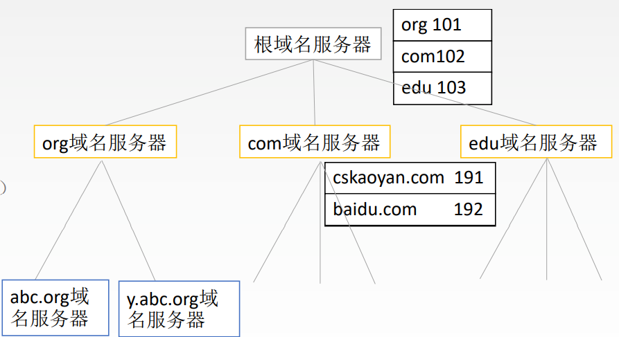
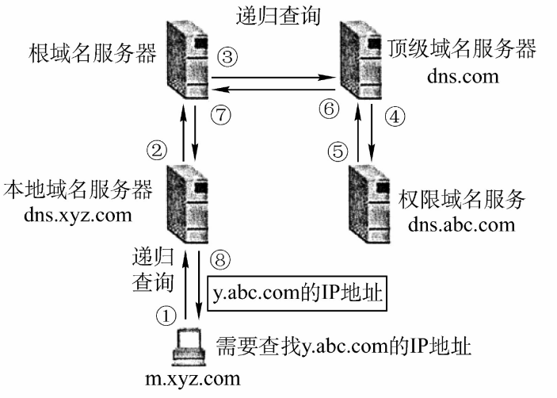
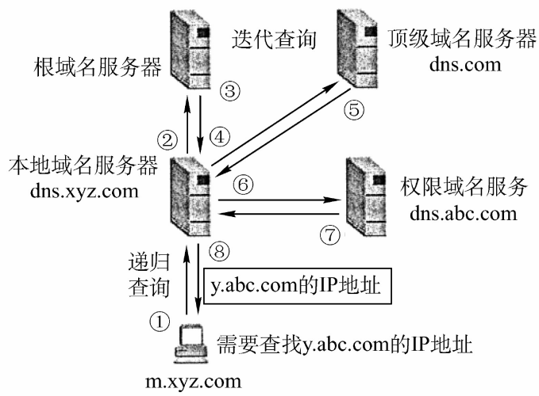

# 6.2 域名系统（DNS）

## 6.2.1 域名

<mark style="color:blue;">**www**</mark>.<mark style="color:green;">**cskaoyan**</mark>.<mark style="color:red;">**com**</mark>

- <mark style="color:red;">**顶级域名**</mark>
  - **国家顶级域名**：cn，us，uk
  - **通用顶级域名**：com，net，org，gov，int，aero，museum，travel
  - **基础结构域名/反向域名**：arpa
- <mark style="color:green;">**二级域名**</mark>
  - **类别域名**：ac，com，edu，gov，mil，net，org
  - **行政区域名**：bj，js
  - **自己注册的**：必须要全球唯一
- <mark style="color:blue;">**三级域名**</mark>
- 四级域名
- ……

### 域名的特征

- 域名不区分大小写
- 域名中的符号只能有 “-”
- 域名中的每一段称为一个<mark style="color:purple;">**标号**</mark>
  - 单个标号的长度不超过36个字符
  - 整体域名不超过255个字符

## 6.2.2 域名服务器

- **根域名服务器**：存储各个顶级域名对应的顶级域名服务器地址
- **顶级域名服务器**：管理该顶级域名注册的所有二级域名
- **权限域名服务器**：负责一个区的域名服务器，将域名转换为所管辖主机的IP地址
- 本地域名服务器：当一个主机发出DNS查询请求时，这个查询请求报文就发给本地域名服务器，本地域名服务器将请求转交至根域名服务器

## 6.2.3 域名解析过程

- DNS协议使用<mark style="color:purple;">**UPD**</mark>传输
- 是<mark style="color:orange;">**无连接**</mark>的

### 1、递归查询

本地域名服务器的查询请求层层转发，最后得到所找域名的IP地址。

### 2、迭代查询

每次查询所得的下一级域名服务器IP返回给本地域名服务器，本地域名服务器亲自动手。

