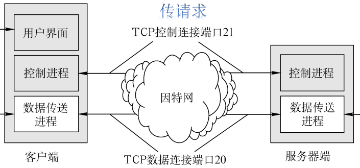

# 6.3 文件传输（FTP）

**文件传送协议FTP（File Transfer Protocol）**： 提供不同种类主机系统（硬、软件体系等都可以不同）之间的文件传输能力。

- FTP是基于<mark style="color:purple;">**C/S**</mark>的协议
- FTP使用<mark style="color:purple;">**TCP**</mark>实现可靠传输
- 用户通过一个客户机程序连接至在远程计算机上运行的服务器程序
- **FTP服务器**：依照FTP协议提供服务，进行文件传送的计算机
- **FTP客户端**：连接FTP服务器，遵循FTP协议与服务器传送文件的电脑

## 6.3.1 FTP工作原理

**登录**：用户通过用户名密码的方式登录到服务器，也可以通过匿名登陆访问公开共享的文件。

### 1、FTP的服务器进程

#### （1）主进程

- 只有一个
- 一直打开，准备响应新的请求

#### （2）从属进程

- 多个
- 需要时打开，负责处理单个请求
- 处理完单个请求后关闭

### 2、工作步骤

1. 打开控制端口（21），使得客户进程能够连接
2. 等待客户进程发送请求
3. 启动从属进程处理请求
4. 主进程继续等待其他请求

## 6.3.2 控制连接与数据连接

- **控制连接**
  - 负责传输请求
  - <mark style="color:orange;">**始终保持连接**</mark>
  - 端口号为21
- **数据连接**
  - 负责传输数据
  - 需要时打开连接
  - 端口号与**传输模式**有关
    - 主动方式：20
    - 被动方式：不确定（>1024）

