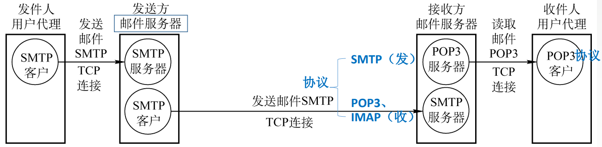

# 6.4 电子邮件

## 6.4.1 电子邮件格式

- 首部
  - From（系统自动生成）：aye10032@gmail.com
  - To（必须填入）：tc_aye@outlook.com
  - Subject（可选）：电子邮件格式
- 主体
  - 正文内容

## 6.4.2 电子邮件组成结构

- **用户代理**
  - 为用户提供的图形界面
  - 例如outlook等
  - 将邮件发送到自身的邮件服务器
- **邮件服务器**
  - 将邮件发送到接收方的邮件服务器
  - 向发件人报告邮件传输结果
  - 可以同时充当服务器和客户
  - 基于<mark style="color:purple;">**C/S**</mark>模式
  - 使用<mark style="color:purple;">**TCP**</mark>连接实现可靠传输

## 6.4.3 SMTP和POP3

### 1、简单邮件传送协议SMTP

- **SMTP客户**：负责发送邮件的SMTP进程
- **SMTP服务器**：负责接收邮件的进程
- SMTP使用的<mark style="color:orange;">**端口号为25**</mark>

#### 传输过程

- **建立连接**
- 邮件发送
- 连接释放

#### SMTP协议的缺点

- SMTP不能传送可执行文件或者其他二进制对象
- SMTP仅限于传送7位ASCII码，不能传送其他非英语国家的文字
- SMTP服务器会拒绝超过一定长度的邮件

#### 通用因特网邮件扩充MINE

可以将原本SMTP不支持传输的格式、语言等转化为7位ASCII码，经由SMTP传输后再恢复为原文件类型。

### 2、邮局协议POP3

- 端口为110
- 将邮件下载至客户端，并视情况
  - 继续保留在服务器中
  - 删除服务器中的邮件

### 3、网际报文存取协议IMAP

- 当用户Pc上的IMAP客户程序打开IMAP服务器的邮箱时，用户可以看到邮箱的首部
- 若用户需要打开某个邮件，该邮件才上传到用户的计算机上
- IMAP可以让用户在不同的地方使用不同的计算机随时上网阅读处理邮件
- IMAP允许只读取邮件中的某一个部分

### 4、基于万维网的电子邮件

使用浏览器登录电子邮箱来收发电子邮件

- **用户代理**
  - 浏览器
  - 通过<mark style="color:purple;">**HTTP协议**</mark>与邮件服务器连接
- **邮件服务器**
  - 使用供应商的邮件服务器而不是自己的
  - 邮件服务器之间的通信协议仍然为SMTP

