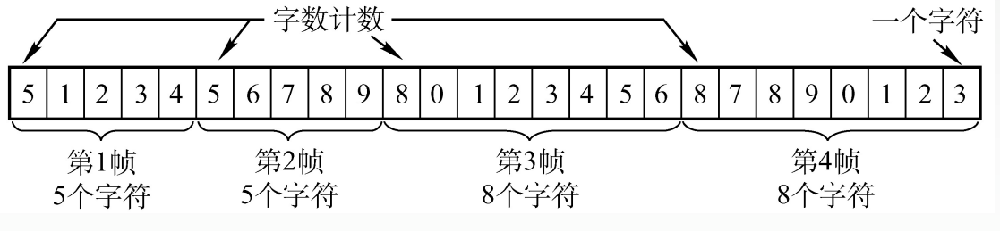

# 3.2 组帧

## 3.2.1 封装成帧和透明传输

### 1、封装成帧

**封装成帧**就是在一段数据的前后部分添加首部和尾部，这样就构成了一个帧。接收端在收到物理层上交的比特流 后，就能根据首部和尾部的标记，从收到的比特流中识别帧的开始和结束。

首部和尾部包含许多的控制信息，其中**帧定界符**的作用就是确定帧的界限。

**帧同步**：接收方应当能从接收到的二进制比特流中区分出帧的起始和终止。



当题目中没有说明时，网络帧的默认**最小大小**为**64B**



### 2、组帧的四种方法

* 字符计数法
* 字符（节）填充法
* 零比特填充法
* 违规编码法

### 3、透明传输

透明传输是指不管所传数据是什么样的比特组合，都应当能够在链路上传送。

## 3.2.2 字符计数法

帧首部使用一个计数字段（第一个字节，八位）来标明帧内字符数，表明包含计数字段在内的帧长度。

**缺点**：当计数字段出现错误会导致严重错误

## 3.2.3 字符填充法

采用特定的字符来标识一帧的开始和结束。

当数据中有和标识字符相同的字符时，由发送发在前面填充<mark style="color:purple;">**转义字符**</mark>，接收方收到后将转义字符去掉得到原数据。

## 3.2.4 零比特填充法

使用固定的比特模式01111110来表示帧的开始和结束。

- 在发送时，每碰到连续的5个1就在后面填充一位0
- 在接收时，先通过01111110找到帧起始，再查找数据中连续的5个1，将其后面删除一位0，得到原数据

**“5 1 1 0”**

## 3.2.5 违规编码法

在曼彻斯特编码中，“高-低”表示1，“低-高”表示0，则“高-高”和“低-低”就是<mark style="color:purple;">**违规编码**</mark>。

使用违规编码标识帧的开始和结束。

