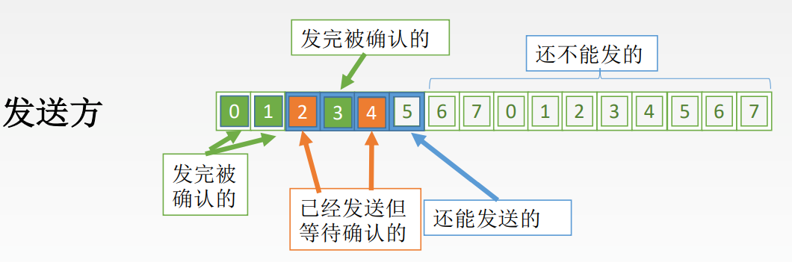
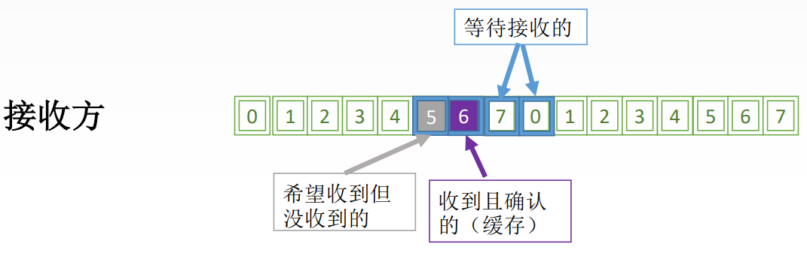

# 3.4 流量控制与可靠传输机制

## 3.4.1 流量传输概述

- 数据链路层
  - 流量控制是点对点的
  - 方法：接收端收不下就不发送确认
- 传输层
  - 流量控制是端到端的
  - 方法：接收端给发送端一个窗口公告

### 1、可靠传输与流量控制

**可靠传输**：发送端发送什么，接收端就接收什么

**流量控制**：控制发送速率，使接收方有足够的缓冲空间来接收每一个帧

### 2、滑动窗口机制

解决可靠传输：发送方自动重传

解决流量控制：在没有收到窗口确认的情况下不发送下一个

## 3.4.2 停止-等待协议

### 1、停止-等待协议概述

“停止-等待”就是每发送完一个分组就停止发送，等待对方确认，在收到确认后再发送下一个分组。

#### 为什么要有停止-等待协议

- 除了比特出差错，底层信道还会出现丢包问题
- 为了实现流量控制

#### 研究停等协议的前提

以半双工的形式进行讨论

不考虑数据是在那一层进行传输的

#### 停等协议有几种情况

- 无差错情况
- 有差错情况

### 2、无差错情况

每一帧就停止等待，所以仅需要一位对帧进行编号。

### 3、有差错情况

#### （1）帧丢失或帧出错

- **超时计时器**：每次发送 一个帧就启动一个计时器
  - 计时器的重传时间比平均传输往返时延（RTT）稍长一些
- 发送一个帧之后需要**保留副本**
- 数据帧和确认帧必须**编号**

### 2、ACK丢失

### 3、ACK迟到

接收方判断到重复的确认帧时就将其丢弃

### 4、停等协议的信道利用率

$$
\begin{align}
\text{信道利用率U}&=\frac{\text{T}_{D}}{\text{T}_{D}+\text{RTT}+\text{T}_{A}}\\
&=\frac{\text{L/C}}{T}\\
信道吞吐率 &= 信道利用率 \times 发送方的发送速率
\end{align}
$$

- $$\text{T}_{D}$$：数据帧的发送时延
- $$\text{RTT}$$：往返时延
- $$\text{T}_{A}$$：确认帧的发送时延
- L：T内发送L比特数据
- C：发送方的数据传输率
- T：发送周期

可见停等协议的**信道利用率较低**。



设一个信道数据传输率为4kb/s，单向传播时延为30ms，若使用停止-等待协议的信道最大利用率为80%，则数据帧的长度至少为多少？

$$80\% = \frac{\text{L}/4}{\text{L}/4 + 2 \times 30}$$

解得 L=960bit/s



## 3.4.3 多帧滑动窗口——后退N帧协议（GBN）

与停等协议相比，GBN：

- 需要更大的编号范围
- 发送方需要缓存多个帧

#### GBN中的滑动窗口

发送方有**多个窗口**，而接收方只有**一个窗口**

- 发送方会依次发送发送窗口内的帧
- 接收方收到后发送确认帧，发送方和接收方的窗口各自向前移动
- 可以只发送最后一个确认帧，代表前面的帧都接收到了
  - 例如发送了3号确认帧，代表0、1、2、3号帧都收到了，窗口各自向前移动4格
- 当采用了n位比特对帧编号时，滑动窗口的大小范围是：$$1 \leq \text{W}_{T} \leq 2^n -1$$

#### （1）发送方的响应事件

- **上层调用**：上层需要发送一个数据
  - 发送窗口已满：将数据返回给上层，或是缓存下来等待空闲窗口
  - 发送窗口未满：将数据封装成帧并发送
- **收到ACK**：对确认帧采用<mark style="color:orange;">**累计确认**</mark>的模式
  - 收到一个确认帧，表示前面的都收到了
- **超时事件**：当出现超时或是帧丢失，将重新发送所有<mark style="color:orange;">**已发送但未确认**</mark>的帧

#### （2）接收方的响应事件

- 正确收到n号帧，则发送确认帧ACK
- 其他情况的收到的帧都丢弃，并返回上一个正确收到的帧的ACK

#### （3）GBN协议的性能分析

- 优点
  - 连续发送帧，提高了信道利用率
- 缺点
  - 重传时需要重传已经发送过的帧，传送效率低

## 3.4.5 选择重传协议（SR）

- <mark style="color:orange;">**单帧确认**</mark>
- 接收方也有多个窗口
- 接收方可以缓存收到的乱序帧
- 当采用了n位比特对帧编号时，滑动窗口的大小范围是：$$\text{W}_{\text{T}}+ \text{W}_{\text{R}}\leq2^{n}$$
  - 发送方和接收方窗口大小一样

#### （1）发送方的响应事件

- **上层调用**：与GBN协议一样，窗口满则发送，否则等待
- **收到ACK**：收到确认帧后，将窗口移动到最近的一个未确认帧处
- **超时**：每个帧有各自的超时计时器，超时后重发单独的某一帧即可

#### （2）接收方的响应事件

- 只要在窗口内，不管顺序一律接收
  - 不在窗口内就丢弃
- 对各个帧发送单独的ACK
- 当**窗口内序号最小的帧**确认接收后，将已收到的帧按顺序返回上层，并移动窗口到最近的未接受帧

