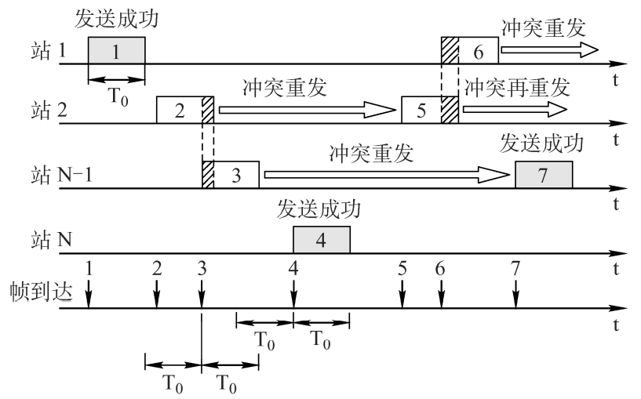
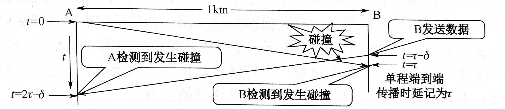
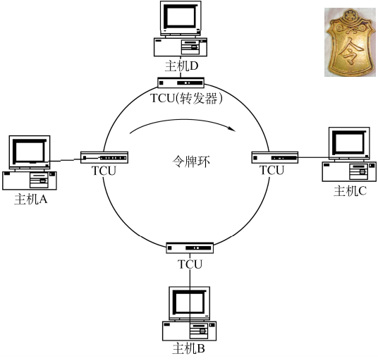

# 3.5 介质访问控制

- **点对点链路**
  - 两个相邻节点的通过链路连接，没有第三者
  - 应用：PPP协议，常用于广域网
- **广播式链路**
  - 所有主机共享通信介质
  - 应用：早期以太网、局域网
  - 拓扑结构：星型（逻辑总线型）、总线型



**介质访问控制**：采取一定的措施，使两对节点之间的通信不会发生互相干扰，分为两种

- 静态划分信道
  - 信道划分介质访问控制
- 动态划分信道
  - 轮询访问介质控制
  - 随机访问介质控制



## 3.5.1 信道划分介质控制

**多路复用**：将多个信号组合在一个信道上进行传输，到目的后再分离为多个信号

<mark style="color:orange;">**本质上**</mark>是将广播信号变为多个点对点链路

### 1、频分多路复用（FDM）

各个用户分配不同的<mark style="color:purple;">**频带**</mark>，之后始终使用相同的频带进行通信。

不同的用户在同样的时间占用不同的<mark style="color:purple;">**带宽**</mark>（模拟信号角度的带宽）

- 系统效率较高
- 实现简单

### 2、时分多路复用（TDM）

将时间划分为等长的<mark style="color:purple;">**时分复用帧**</mark>，每一帧划分为若干<mark style="color:purple;">**时隙**</mark>。

每一个用户在一个TDM帧中占用固定序号的时隙。

#### 改进：统计时分复用（STDM）

使用集中器收集各个用户的数据，并按照先后顺序存入自己的缓存，之后按照先后顺序填充STDM帧，帧满即发送出去。

STDM帧大小小于连接在集中器上的用户数。

### 3、波分多路复用（WDM）

介质为光纤，原理类似于<mark style="color:orange;">**光的频分多路复用**</mark>。

### 4、码分多路复用（CDM）

**码分多址（CDMA）**：将一个比特位用一组特定的<mark style="color:purple;">**码片**</mark>发送，每一个用户拥有唯一的码片。

码片直接发送代表1，反码发送代表0。

对于各个用户的码片，要求其<mark style="color:orange;">**规格化内积等于0，且其自身的内积为1**</mark>，即：
$$
\boldsymbol{S}\cdot\boldsymbol{T} \equiv \frac{1}{m} \sum_{i=1}^{m}\boldsymbol{S}_{i}\cdot\boldsymbol{T}_{i} = 0\\
\boldsymbol{S}\cdot\boldsymbol{S} \equiv \frac{1}{m} \sum_{i=1}^{m}\boldsymbol{S}_{i}^{2}=1
$$

- m为码片的位数
- S和T分别为两个用户的码片

#### 两个数据的结合

将两个码片线性相加：
$$
\boldsymbol{S}\pm\boldsymbol{T}
$$
中间符号视发送0或1变化（反码即为 -）

#### 两个数据的分离

将合并的数据与码片取规格化内积：
$$
\boldsymbol{S}\cdot(\boldsymbol{S-T}) = \frac{1}{m} \sum_{i=1}^{m}\boldsymbol{S}_{i}\cdot(\boldsymbol{S-T})_{i}
$$
得到的结果即为S对应用户发送的比特位。

## 3.5.2 随机访问介质控制

所有的用户可以随机的发送信息，发送信息时占用<mark style="color:orange;">**全部带宽**</mark>。

### 1、ALOHA协议

- 不监听信道
- 不按时间槽发送
- 随即重发

#### 冲突检测

在传输数据发送冲突时，接收方收到错误的帧，则返回错误信号（或不发送确认信号）

接收方在发现超时或错误后在**随机时间**内重新发送数据帧

#### 时隙ALHOA协议

把时间分成若干个相同的**时间片**，所有用户在时间片开始时刻同步接入网络信道，若发生冲突，则必须等到下一个时间片开始时刻再发送

- 比纯ALHOA效率更高，吞吐量更高
- 只有在时间片（时隙）开始时才能发送

### 2、CSMA协议

**载波监听多路访问协议（CSMA）**：在发送帧之前，先<mark style="color:orange;">**监听**</mark>信道，并信道状态决定是否发送数据

- **CS**：载波侦听/监听，每一个站在发送数据之前要检测一下总线上是否有其他计算机在发送数据
- **MA**：多点接入，表示许多计算机以多点接入的方式连接在一根总线上

#### （1）1-坚持CSMA

- 信道空闲
  - 直接传输数据
- 信道忙碌
  - 一直监听信道，空闲马上传输
- 发生冲突
  - 一段时间内未收到确认回复，则等待一段时间继续开始监听信道

**优点**：只要媒体空闲，站点就马上发送，避免了媒体利用率的损失。 

**缺点**：假如有两个或两个以上的站点有数据要发送，冲突就不可避免。

#### （2）非坚持CSMA

- 信道空闲
  - 直接传输数据
- 信道忙碌
  - 等待随机时间后继续开始监听

**优点**：采用随机的重发延迟时间可以<mark style="color:orange;">**减少冲突发生的可能性**</mark>。
**缺点**：可能存在大家都在延迟等待过程中，使得媒体仍可能处于空闲状态，媒体使用率降低。

#### （3）p-坚持CSMA

- 信道空闲
  - 直接发送的概率为p
  - 否则等待到下一个时间槽再传输，概率为p-1
- 信道忙碌
  - 持续监听等待空闲
- 发生冲突
  - 等待下一个时间槽再次开始监听

**优点**：既能像非坚持算法那样减少冲突，又能像1-坚持算法那样减少媒体空闲时间

**缺点**：发生冲突后还是要坚持把数据帧发送完，造成了浪费

### 3、CSMA/CD协议

载波监听多点接入/碰撞检测CSMA/CD（carrier sense multiple access with collision detection）

- CS：载波侦听/监听
- MA：多点接入
- CD：碰撞检测（冲突检测），“边发送边监听”，适配器边发送数据边检测信道上信号电压的变化情况，以便判断自己在发送数据时其他站是否也在发送数据

属于<mark style="color:purple;">**半双工网络**</mark>

#### （1）碰撞检测

- $$\tau$$：单程传播时延
- $$\tau - \delta$$：B发送数据的时间点
- $$2\tau - \delta$$：A检测到碰撞的时间点

若经过$$2\tau$$的时间还没有检测到碰撞，则说明此次传输<mark style="color:orange;">**没有发生碰撞**</mark>，$$2\tau$$被称为<mark style="color:purple;">**争议期（冲突窗口、碰撞窗口）**</mark>。

检测到碰撞即叫停帧的传输，等待时机重新发送。

#### （2）确定重传时机——截断二进制指数规避法

1. 确定<mark style="color:purple;">**基本退避时间**</mark>，一般为$$2\tau$$
2. 定义<mark style="color:purple;">**重传次数k**</mark>，k不超过10
3. 从在$$[0,\ 2^{k}-1]$$的范围内任取一个<mark style="color:orange;">**整数r**</mark>，重传所需要推迟的时间即为：$$r \times \text{基本退避时间} = r\cdot 2\tau$$
4. 当重传<mark style="color:orange;">**16次**</mark>仍然不成功时说明网络拥挤，抛弃此帧并向上层报告出错
5. **特点**
   - 将后退延时的平均时长与负载关联了起来

#### （3）最小帧长

为了防止在检测到碰撞之前帧就已经发送完毕，要求<mark style="color:purple;">**帧的传输时延**</mark>要大于最大的碰撞检测时间，即<mark style="color:purple;">**两倍的单程传播时延**</mark>。
$$
\frac{帧长(bit)}{数据传输速率} \geq 2\tau
$$
由此可得数据传输的最小帧长：
$$
\begin{align}
最小帧长 &= 2 \times 总线传播时延 \times 数据传输速率\\
 &= 2\tau \times 数据传输速率
\end{align}
$$
对于小于最小帧长的帧，会对其进行<mark style="color:orange;">**填充**</mark>，使其达到最小帧长再发送。

### 4、CSMA/CA协议

载波监听多点接入/碰撞**避免**CSMA/CA（carrier sense multiple access with collision avoidance）

使用CSMA/CA协议的原因：

- 无线局域网中CSMA/CD的检测实现较为困难
- **屏蔽站**：当A和C都检测不到信号，认为信道空闲时，同时向终端B发送数据帧，就会导致冲突

#### （1）工作原理

**发送端**：

- 信道空闲
  - 发送RTS：包含发射端地址、接收端地址、数据发送持续时间等
- 信道忙
  - 等待

**接收端**：收到RTS后，发出CTS响应请求

**发送端**：收到CTS后，开始发送数据帧，并<mark style="color:orange;">**预约信道**</mark>

**接收端**：收到数据后进行CRC校验，正确则响应ACK

**发送端**：

- 收到ACK
  - 继续发送下一帧，循环直到结束
- 未收到ACK
  - 使用<mark style="color:purple;">**二进制指数退避算法**</mark>确定推迟重发的时间



**预约信道**：告诉其他站点自己要传多久数据

**RTS/CTS帧**：站点没有收到响应自己的CTS之前无法发送数据，解决了隐蔽站问题



## 3.5.3 轮询访问介质访问控制

### 1、轮询协议

主结点轮流“邀请”从属结点发送数据。

**缺点**：

- 轮询开销
- 等待延时
- 单点故障（主节点故障则整个网络瘫痪）

### 2、令牌传递协议

- 令牌在网络上循环传递
- 有主机需要发送信息时截获令牌
  - 修改标志位，将令牌占用
  - 将数据附加在令牌后，形成数据帧
  - 再将令牌发送出去
- 令牌继续循环
  - 目标主机将数据部分复制副本
  - 非目标主机直接传走
- 令牌再次回到发送主机
  - 进行校验，若数据出错则再次发送
  - 将数据移除，标志位复位，继续传送令牌

**令牌持有时间**：每一个主机能占用令牌的时间是有限的，没有传递完则需要等待下一轮循环到自己再继续发送

**缺点**：

- 令牌开销
- 等待延迟
- 单点故障（一个节点故障则循环不能继续）

适用于**负载较重、通信量较大**的网络中，应用于令牌环网（**物理星型拓扑**，**逻辑环形拓扑**）。

