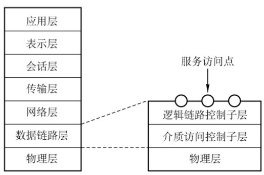
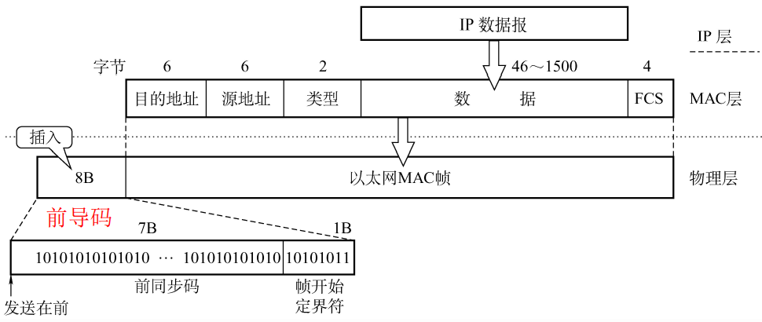

# 3.6 局域网

## 3.6.1 局域网基本概念和体系结构

### 1、决定局域网的主要要素

- 网络拓扑
- 传输介质
- 介质访问控制方法

### 2、局域网拓扑结构

- 星型拓扑
  - 便于搭建
  - 单点故障
- 总线型拓扑
  - 好
- 环形拓扑
  - 不便于扩充、单点故障
- 树形拓扑
  - 易于拓展

### 3、局域网传输介质

- 有线局域网
  - 双绞线
  - 同轴电缆
  - 光纤
- 无线局域网
  - 电磁波

### 4、局域网介质访问控制方法

- **CSMA/CD**：用于总线型、树形局域网
- **令牌总线**：用于总线型、树形局域网
  - 将一条总线上的设备编成一个<mark style="color:orange;">**逻辑环**</mark>，顺序使用总线资源
- **令牌环**：用于环形局域网

### 5、局域网的分类

- **以太网**
  - 结构：逻辑拓扑为总线型，物理拓扑为星型或拓展星型
  - 使用CSMA/CD
  - 标准为IEEE 802.3标准
- **令牌环网**：不用了
  - 采用IEEE 802.5标准
- **FDDI**：光纤分布式数字接口
  - 逻辑拓扑为环形拓扑结构，物理拓扑为双环形拓扑结构
  - 采用IEEE 802.8标准
- **WLAN**：无线局域网
  - 采用IEEE 802.11标准

## 3.6.2 以太网与IEEE 802.3标准

### 1、MAC子层和LLC子层

将数据链路层分为了两个子层

- **LLC子层**：逻辑链路控制子层，为网络层提供服务
  - 无确认无连接、 面向连接、带确认无连接
  - 高速传送
- **MAC子层**：介质访问控制子层
  - 数据帧的封装/卸装
  - 帧的寻址和识别
  - 帧的接收与发送
  - 链路的管理
  - 帧的差错控制

### 2、以太网概述

#### 以太网的两个标准

- DIX Ethernet V2
- IEEE 802.3

以太网使用CSMA/CD技术，提供<mark style="color:orange;">**无连接、不可靠**</mark>的连接服务。

#### 以太网的传输介质和拓扑结构

**传输介质发展历程：**

- 粗同轴电缆
- 细同轴电缆
- 双绞线+集线器

**拓扑结构：**

- 逻辑上
  - 总线型
- 物理上
  - 星型

### 3、以太网MAC帧

- **前导码**：不属于MAC帧，用于标识MAC开始
- MAC帧
  - **目的地址、源地址**：均为MAC地址，用6个十六进制数表示的48位二进制数
  - **类型**：表示数据使用何种协议
  - **数据**：46~1500字节大小
    - 46字节：以太网中的最小帧长为64B，64-(6+6+2+4)=46
    - 1500字节：规定的最大帧长
  - **FCS**：CRC循环冗余校验使用

### 4、高速以太网

#### （1）10BASE-T以太网

- **传输介质**：（屏蔽）双绞线为介质
- **编码**：曼彻斯特编码
- **拓扑结构**
  - 逻辑：总线型
  - 物理：星型
- **介质访问控制**：CSMA/CD
- **通信方式**：全双工、半双工
- **传输速率**：100Mb/s的信号

#### （2）吉比特以太网

- **传输介质**：光纤、双绞线
- **传输速率**：1Gb/s
- **通信方式**：全双工、半双工

#### （3）10吉比特以太网

- **传输介质**：光纤
- **传输速率**：10Gb/s
- **通信方式**：全双工

## 3.6.3 IEEE 802.11与无线局域网

