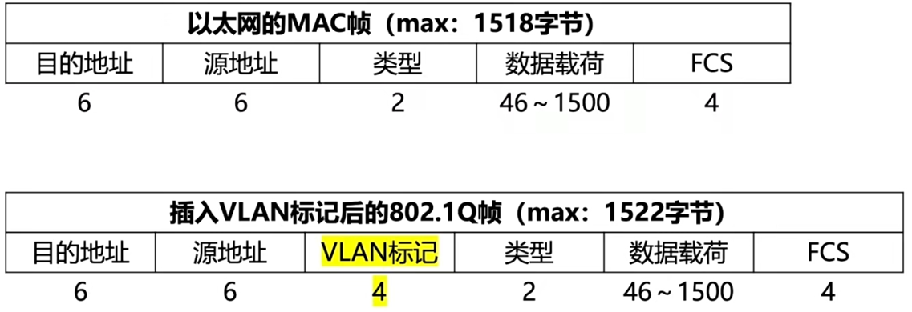

# 3.6 局域网

## 3.6.1 局域网基本概念和体系结构

### 1、决定局域网的主要要素

- 网络拓扑
- 传输介质
- 介质访问控制方法

### 2、局域网拓扑结构

- 星型拓扑
  - 便于搭建
  - 单点故障
- 总线型拓扑
  - 好
- 环形拓扑
  - 不便于扩充、单点故障
- 树形拓扑
  - 易于拓展

### 3、局域网传输介质

- 有线局域网
  - 双绞线
  - 同轴电缆
  - 光纤
- 无线局域网
  - 电磁波

### 4、局域网介质访问控制方法

- **CSMA/CD**：用于总线型、树形局域网
- **令牌总线**：用于总线型、树形局域网
  - 将一条总线上的设备编成一个<mark style="color:orange;">**逻辑环**</mark>，顺序使用总线资源
- **令牌环**：用于环形局域网

### 5、局域网的分类

- **以太网**
  - 结构：逻辑拓扑为总线型，物理拓扑为星型或拓展星型
  - 使用CSMA/CD
  - 标准为IEEE 802.3标准
- **令牌环网**：不用了
  - 采用IEEE 802.5标准
- **FDDI**：光纤分布式数字接口
  - 逻辑拓扑为环形拓扑结构，物理拓扑为双环形拓扑结构
  - 采用IEEE 802.8标准
- **WLAN**：无线局域网
  - 采用IEEE 802.11标准

## 3.6.2 以太网与IEEE 802.3标准

### 1、MAC子层和LLC子层

将数据链路层分为了两个子层

- **LLC子层**：逻辑链路控制子层，为网络层提供服务
  - 无确认无连接、 面向连接、带确认无连接
  - 高速传送
  - 差错控制
  - 给帧加序号
- **MAC子层**：介质访问控制子层
  - 数据帧的封装/卸装
  - 帧的寻址和识别
  - 帧的接收与发送
  - 竞争处理
  - 比特差错检测

### 2、以太网概述

#### 以太网的两个标准

- DIX Ethernet V2
- IEEE 802.3

以太网使用CSMA/CD技术，提供<mark style="color:orange;">**无连接、不可靠**</mark>的连接服务。

#### 以太网的传输介质和拓扑结构

**传输介质发展历程：**

- 粗同轴电缆
- 细同轴电缆
- 双绞线+集线器

|     参数     |    10BASE-5    |    10BASE-2    |   10BASE-T   |  10BASE-FL   |
| :----------: | :------------: | :------------: | :----------: | :----------: |
|   传输媒体   | 同轴电缆（粗） | 同轴电缆（细） | 非屏蔽双绞线 |     光纤     |
|     编码     |  曼彻斯特编码  |  曼彻斯特编码  | 曼彻斯特编码 | 曼彻斯特编码 |
|   拓扑结构   |     总线型     |     总线型     |     星型     |    点对点    |
|   最大段长   |      500m      |      185m      |     100m     |    2000m     |
| 最多节点数目 |      100       |       30       |      2       |      2       |

**拓扑结构：**

- 逻辑上
  - 总线型
- 物理上
  - 星型

### 3、以太网MAC帧

- **前导码**：不属于MAC帧，用于标识MAC开始
- MAC帧
  - **目的地址、源地址**：均为MAC地址，用6个十六进制数表示的48位二进制数
  - **类型**：表示数据使用何种协议
  - **数据**：46~1500字节大小
    - 46字节：以太网中的最小帧长为64B，64-(6+6+2+4)=46
    - 1500字节：规定的最大帧长
  - **FCS**：CRC循环冗余校验使用

### 4、高速以太网

#### （1）10BASE-T以太网

- **传输介质**：（屏蔽）双绞线为介质
- **编码**：曼彻斯特编码
- **拓扑结构**
  - 逻辑：总线型
  - 物理：星型
- **介质访问控制**：CSMA/CD
- **通信方式**：全双工、半双工
- **传输速率**：100Mb/s的信号

#### （2）吉比特以太网

- **传输介质**：光纤、双绞线（5类线）
- **传输速率**：1Gb/s
- **通信方式**：全双工、半双工

#### （3）10吉比特以太网

- **传输介质**：光纤
- **传输速率**：10Gb/s
- **通信方式**：全双工

### 5、以太网卡

- 网卡实现的功能主要位于物理层和数据链路层
- 每个网卡之间使用<mark style="color:purple;">**曼彻斯特机制**</mark>来进行同步
- 以太网卡具有的独一无二的代码，称为<mark style="color:purple;">**介质访问控制(MAC)地址**</mark>

## 3.6.3 IEEE 802.11与无线局域网

### 1、802.11 MAC帧头格式

- RA：接收端所连接AP的MAC地址
- TA：发送端所连接AP的MAC地址
- DA：接收端的MAC地址
- SA：发送端的MAC地址

#### 不同的MAC帧头格式

|         |    Add1    |    Add2    |   Add3   |  Add4  | From DS | To DS |
| :-----: | :--------: | :--------: | :------: | :----: | :-----: | :---: |
|  IBSS   |     DA     |     SA     |  BSSID   |   -    |    0    |   0   |
|  To AP  |  AP的地址  |   源地址   | 目的地址 |   -    |    0    |   1   |
| From AP |  目的地址  |  AP的地址  |  源地址  |   -    |    1    |   0   |
|   WDS   | 下一条地址 | 上一跳地址 | 目的地址 | 源地址 |    1    |   1   |

### 2、IEEE 802.11标准

- 有固定基础设施的无线局域网
  - 每台设备通过AP组成一个<mark style="color:purple;">**基本服务集（BSS）**</mark>
  - AP之间通过<mark style="color:purple;">**主干分配系统（DS）**</mark>相连接，构成<mark style="color:purple;">**扩展服务集（ESS）**</mark>
- 无固定基础设施的无线局域网
  - 设备之间自由组网，保持在一个网段内，没有AP等设备

## 3.6.4 VLAN

### 1、传统局域网的缺陷

- **缺乏流量隔离**：广播流量会跨越整个机构网络（ARP、RIP、DHCP协议）
- 一个单位的不同部门共享一个局域网，对安全不利

### 2、VLAN

- 将局域网内的设备划分成与物理位置无关的逻辑组的技术
- VLAN是通过软件的方式实现的，因此节点的位置不受物理位置的限制

- 每个VLAN是一个单独的广播域/不同的子网

- **实现**
  - **基于接口**：交换机中除了转发表，还存在一张VLAN表，记录了各个端口号和它对应的VLAN号
  - **基于MAC地址**：VALN表中记录的是各个MAC地址和它对应的VLAN号
  - **基于IP地址**：可以进行跨路由器扩展
- **VLAN之间的通信**：将帧上附加相应的VLAN标签
- **优点**
  - 有效的共享资源
  - 优化管理
  - 提高了安全性

### 3、IEEE 802.1Q帧

- VLAN标记共4个字节
  - 前两个字节表明这是一个IEEE802.1Q帧
  - 之后4位无用
  - 后12位是<mark style="color:purple;">**VLAN标识符VID**</mark>
- 802.1Q帧是由交换机处理的，主机和交换机间交换的就是普通的MAC帧
