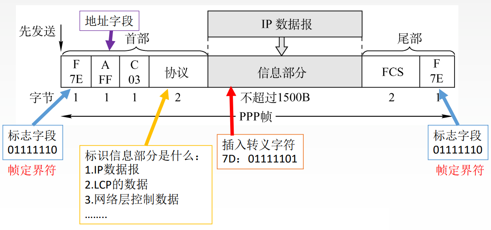
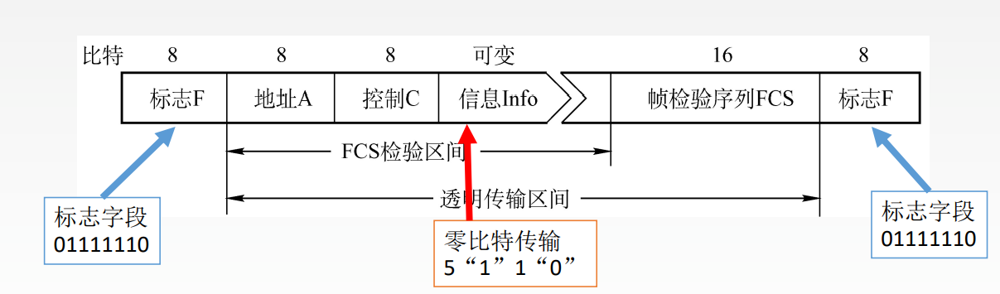

# 3.7 广域网

## 3.7.1 广域网概述

- 广域网
  - 协议位于网络层、数据链路层、物理层
  - 强调资源共享
  - 采用点到点连接
  - 通信子网采用分组交换技术
- 局域网
  - 协议位于数据链路层、物理层
  - 强调数据传输
  - 采用多点接入模式

## 3.7.2 PPP协议

- 点对点协议
- 只支持<mark style="color:orange;">**全双工通信**</mark>

#### PPP协议的特点

- PPP协议应当满足
  - **简单**：对于链路层的帧，无需纠错，无需序号，无需流量控制。
  - **封装成帧**：添加帧定界符
  - **透明传输**：与帧定界符一样比特组合的数据应该如何处理
    - 异步线路用字节填充
    - 同步线路用比特填充
  - **多种网络层协议**：封装的IP数据报可以采用多种协议。
  - **多种类型链路**：串行/并行， 同步/异步，电/光...
  - **差错检测**：错就丢弃。
  - **检测连接状态**：链路是否正常工作。
  - **最大传送单元**：数据部分最大长度MTU。
  - **网络层地址协商**：知道通信双方的网络层地址。
  - 数**据压缩协商**
- PPP协议无需满足
  - 纠错
  - 流量控制
  - 序号：为帧编号
  - 不支持多点线路

#### PPP协议的组成要素

1. 一个将IP数据报封装到串行链路（同步串行/异步串行）的方法
2. **链路控制协议LCP**：建立并维护数据链路连接（物理连接）
3. **网络控制协议NCP**：PPP可支持多种网络层协议，每个不同的网络层协议都要一个相应的NCP来配置，为网络层协议建立和配置逻辑连接（逻辑链接）

#### PPP协议的连接流程

- 设备之间建立物理链路
- 设备之间建立LCP链路
  - 进行鉴别成功，连接建立
  - 鉴别失败，链路关闭
- 通过已建立的LCP链路建立NCP链路

#### PPP协议的帧格式

- **帧定界符**：标识帧的开始和结束
- **地址字段A、控制字段C**：无用
- **协议**：信息部分的数据类型
  - IP数据报
  - LCP的数据
  - 网络层控制数据
- **数据部分**：使用转义字符区分与帧定界符相同的数据字
- **FCS**：CRC循环冗余校验用

PPP协议是一种<mark style="color:orange;">**面向字符**</mark>的协议

## 3.7.3 HDLC协议

高级数据链路控制（High-Level Data Link Control或简称HDLC），采用<mark style="color:orange;">**全双工通信**</mark>，所有帧采用CRC检验，对信息帧进行顺序编号

#### HDLC的站

- **主站**
  - 发送命令（包括数据信息）帧
  - 接收响应帧
  - 负责对整个链路的控制系统的初启、流程的控制、差错检测或恢复等
- **从站**
  - 是接收由主站发来的命令帧
  - 向主站发送响应帧
  - 配合主站参与差错恢复等链路控制
- **复合站**：既能发送，又能接收命令帧和响应帧

#### HDLC的数据操作方式

- 正常响应方式
- 异步平衡方式
- 异步响应方式

#### HDLC的帧格式

帧中比特采用<mark style="color:purple;">**零比特填充法**</mark>实现透明传输

- **标志字段**：标志帧的开始和结束
- **地址字段**：取决于采用何种数据操作方式
  - 正常响应方式、异步响应方式：从站的地址
  - 异步平衡方式：应答站的地址
- **控制字段**：HDLC协议的类型
  - **信息帧**
  - **监督帧**
  - **无编号帧**

## 3.7.4 两种协议的比较

- PPP协议
  - 面向字节
  - 有2B的协议字段
  - 无序号和确认机制
  - 不可靠
- HDLC协议
  - 面向比特
  - 通过控制字段标志协议
  - 有序号和确认机制
  - 可靠

## 3.7.5 广域网、局域网与互联网的关系

- 互联网可以连接不同类型的网络，使用路由器连接
- 广域网是类型单一的网络，使用节点交换机连接
- 从互联网的角度，广域网和局域网是平等关系
- 以太网是局域网的一种实现形式，逻辑拓扑是总线型结构，物理拓扑是星型
