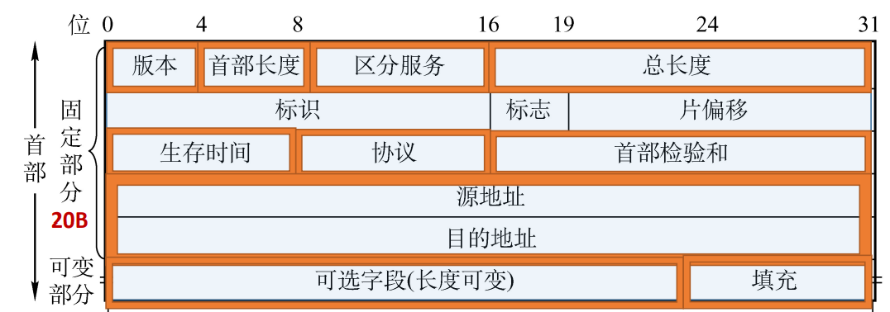
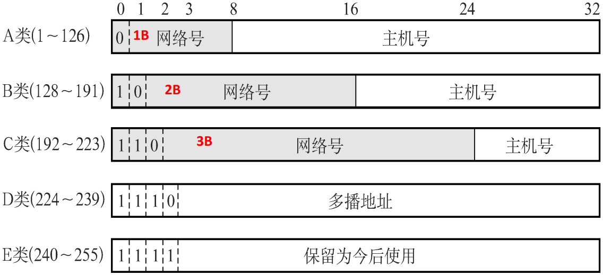

# 4.2 IPV4

## 4.2.1 IP分组

### 1、IP数据报的格式

- **版本**（4bit）：IPV4/IPV6
- **首部长度**（4bit）：标识首部的长度
  - <mark style="color:orange;">**单位是4B**</mark>
  - 最小为5（0101）：20B
  - 最大为15（1111）：60B
- **区分服务**（8bit）：指示期望获得哪 种类型的服务
- **总长度**（16bit）：整个数据报（首部+数据）的长度
  - <mark style="color:orange;">**单位是1B**</mark>
- **标识**（16bit）：同一数据报的分片使 用同一标识
- **标志**（3bit）
  - 最高位无用
  - 中间位DF（Don’t Fragment）
    - DF=1：禁止分片
    - DF=0：允许分片
  - 最低位位MF （More Fragment）
    - MF=1：后面还有分片
    - MF=0：最后一个分片
- **片偏移**（13bit）：指出较长分组分片后，某片在原分组中的相对起始位置
  - <mark style="color:orange;">**单位是8B**</mark>
- **生存时间**（8bit）：IP分组的保质期
  - 每经过一个路由器-1
  - 变成0时丢弃
- **协议**（8bit）：数据部分（即传输层报文段）所采用的协议
  - TCP：6
  - UPD：17
- **首部检验和**（16bit）：检验首部信息
- **源地址、目的地址**（各32bit）：来源和目标的IP地址
- 可选字段（0~40B）：支持排错、 测量以及安全等措施
- **填充**：保证首部长度为4B的整数倍

### 2、IP数据报分片

**最大传送单元MTU**：链路层数据帧可封装数据的上限。以太网的MTU是1500字节（B）。

因此，网络层的首部+数据部分的最大长度就为1500B。

分片时，分组从0开始，通过将每一个分组的起始分组号/8得到片偏移量。



**每一个分片的长度一定是8B的整数倍**。





例：已知数据报首部为20B，数据部分为3800B，将其分为长度不超过1420B的数据报片

每一片的**数据部分**长度$$=1420 - 20 = 1400$$

分为三片：$$1400+1400+1000 = 3800$$

分别的偏移量：

- 第一片：$$0 \div 8 = 0$$
- 第二片：$$1400 \div 8 = 175$$
- 第三片：$$2800\div 8 = 350$$



## 4.2.2 IPV4地址

### 1、分类的IP地址

|     IP地址      | 作为源地址 | 作为目的地址 |                    用途                    |
| :-------------: | :--------: | :----------: | :----------------------------------------: |
|     0.0.0.0     |     ✔      |      ❌       | 本网络范围内表示主机，路由表内表示默认路由 |
|     0.0.0.X     |     ✔      |      ❌       |         本网络范围内的某个特定主机         |
| 255.255.255.255 |     ❌      |      ✔       |               本网络广播地址               |
|     X.X.X.0     |     ❌      |      ❌       |             表示某一个**网络**             |
|    X.X.X.255    |     ❌      |      ✔       |             对特定网络进行广播             |
|    127.X.X.X    |     ✔      |      ✔       |                  本地环回                  |

