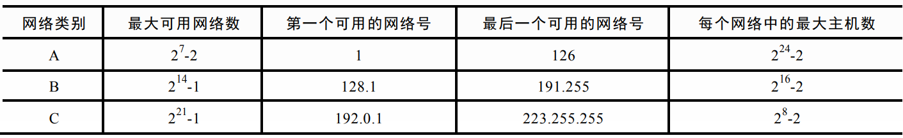
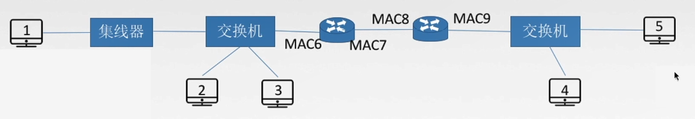
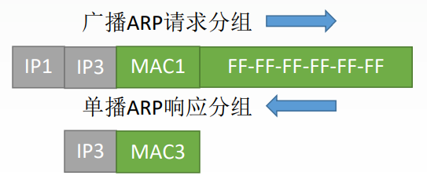

# 4.2 IPV4

## 4.2.1 IP分组

### 1、IP数据报的格式

- **版本**（4bit）：IPV4/IPV6
- **首部长度**（4bit）：标识首部的长度
  - <mark style="color:orange;">**单位是4B**</mark>
  - 最小为5（0101）：20B
  - 最大为15（1111）：60B
- **区分服务**（8bit）：指示期望获得哪 种类型的服务
- **总长度**（16bit）：整个数据报（首部+数据）的长度
  - <mark style="color:orange;">**单位是1B**</mark>
- **标识**（16bit）：同一数据报的分片使 用同一标识
- **标志**（3bit）
  - 最高位无用
  - 中间位DF（Don’t Fragment）
    - DF=1：禁止分片
    - DF=0：允许分片
  - 最低位位MF （More Fragment）
    - MF=1：后面还有分片
    - MF=0：最后一个分片
- **片偏移**（13bit）：指出较长分组分片后，某片在原分组中的相对起始位置
  - <mark style="color:orange;">**单位是8B**</mark>
- **生存时间**（8bit）：IP分组的保质期
  - 每经过一个路由器-1
  - 变成0时丢弃
- **协议**（8bit）：数据部分（即传输层报文段）所采用的协议
  - TCP：6
  - UPD：17
- **首部检验和**（16bit）：检验首部信息
- **源地址、目的地址**（各32bit）：来源和目标的IP地址
- 可选字段（0~40B）：支持排错、 测量以及安全等措施
- **填充**：保证首部长度为4B的整数倍

### 2、IP数据报分片

**最大传送单元MTU**：链路层数据帧可封装数据的上限。以太网的MTU是1500字节（B）。

因此，网络层的首部+数据部分的最大长度就为1500B。

分片时，分组从0开始，通过将每一个分组的起始分组号/8得到片偏移量。



**每一个分片的长度一定是8B的整数倍**。





例：已知数据报首部为20B，数据部分为3800B，将其分为长度不超过1420B的数据报片

每一片的**数据部分**长度$$=1420 - 20 = 1400$$

分为三片：$$1400+1400+1000 = 3800$$

分别的偏移量：

- 第一片：$$0 \div 8 = 0$$
- 第二片：$$1400 \div 8 = 175$$
- 第三片：$$2800\div 8 = 350$$



## 4.2.2 IPV4地址

### 1、分类的IP地址

#### （1）特殊的IP地址

|     IP地址      | 作为源地址 | 作为目的地址 |                    用途                    |
| :-------------: | :--------: | :----------: | :----------------------------------------: |
|     0.0.0.0     |     ✔      |      ❌       | 本网络范围内表示主机，路由表内表示默认路由 |
|     0.0.0.X     |     ✔      |      ❌       |         本网络范围内的某个特定主机         |
| 255.255.255.255 |     ❌      |      ✔       |               本网络广播地址               |
|     X.X.X.0     |     ❌      |      ❌       |             表示某一个**网络**             |
|    X.X.X.255    |     ❌      |      ✔       |             对特定网络进行广播             |
|    127.X.X.X    |     ✔      |      ✔       |                  本地环回                  |

#### （2）私有IP地址

| 地址类别 |              地址范围               | 网段个数 |
| :------: | :---------------------------------: | :------: |
|   A类    |   **10**.0.0.0~**10**.255.255.255   |    1     |
|   B类    |  **127.16**.0.0~**127.31**.255.255  |    16    |
|   C类    | **192.168.0**.0~**192.168.255**.255 |   256    |

#### （3）最大可用地址数量

- A类网络
  - 最大可用网络数
    - 减去全零（本地网络）
    - 减去127（本地环回）
  - 最大可用主机数
    - 减去全零（本网络）
    - 减去全一（255，广播）
- B类网络
  - 最大可用网络数
    - 减去128.0（不可指派）
  - 最大主机数
    - 减去全零（本网络）
    - 减去全一（255，广播）
- C类网络
  - 最大可用网络数
    - 减去192.0.0（不可指派）
  - 最大主机数
    - 减去全零（本机）
    - 减去全一（255，广播）

### 2、 网络地址转换NAT

- 安装了NAT软件的路由器叫**NAT路由器**，它至少有一个有效的外部全球IP地址
- 局域网中的每台设备使用私有IP，这些地址无法作为源地址和目的地址

每个路由器中存在一张NAT转换表，将私有地址+端口号与路由器IP+端口号一一对应，通过这一方法即可实现访问内网的计算机。

## 4.2.3 子网划分与子网掩码

### 1、子网划分

#### 分类IP地址的缺点

- IP地址空间利用率低
- 两级IP地址不够灵活

#### 子网划分

将原本IP地址的主机号再次进行划分，得到子网号+新的主机号

- 子网号能否全0全1看情况（是否采用CIDR）
- 主机号不能全0或全1
  - 全0：本机
  - 全1：广播
- 主机号至少要有两位

子网划分后，网络对外**仍然表现为一个网络**，外部看不到内部网络中的子网划分。

### 2、子网掩码

将网络号的部分全部表示为1，主机号的部分全部表示为0，即得到子网掩码

- 对于两级IP地址（未划分子网），网络号部分为1，即为子网掩码
- 对于三级IP地址（划分子网），网络号+子网号的部分为1，即为子网掩码

#### （1）IP地址与子网地址的计算

将IP地址与子网掩码逐位<mark style="color:purple;">**相与**</mark>，即得到网络地址



**相与**：两个对应的位均为1，结果为1；否则结果为0





例1：已知IP地址是141.14.72.24，子网掩码是255.255.192.0，求网络地址；如果子网掩码是255.255.224.0，求网络地址
$$
\begin{align*}
72 &= 01001000\\
192&= 11000000\\
result & = 01000000 = 64
\end{align*}
$$
故网络地址为141.14.64.0
$$
\begin{align*}
72 &= 01001000\\
192&= 11100000\\
result & = 01000000 = 64
\end{align*}
$$
网络地址为141.14.64.0



#### （2）常见的不同位数子网掩码表

|  二进制  | 十进制 |
| :------: | :----: |
| 10000000 |  128   |
| 11000000 |  192   |
| 11100000 |  224   |
| 11110000 |  240   |
| 11111000 |  248   |
| 11111100 |  252   |
| 11111110 |  254   |
| 11111111 |  255   |

### 3、使用子网时的分组转发

源路由器发送给目标路由器的路由表中，包含了以下信息：

- 目的网络地址
- 目的子网掩码
- 下一跳地址

目标路由器收到后，分组转发的算法顺序如下：

- 提取目标IP地址
- 将IP地址与自己网络中的各子网的子网掩码相与，结果与目的子网掩码对比
  - 有相同的子网掩码：直接交付
  - 没有相同的子网掩码：下一步
- 检查自己路由表中的<mark style="color:purple;">**特定主机路由**</mark>（直接指向某个路由器）
  - 存在与目标IP匹配的特定主机路由：转发
  - 否则下一步
- 检查路由表中记录的的所有子网掩码，一一做与运算并对比
  - 存在与目标子网掩码相同的记录：按照路径转发
  - 否则下一步
- 转发到默认路由0.0.0.0进行处理

当分组的<mark style="color:orange;">**生命周期耗尽**</mark>时，**丢弃该分组**，并转发报告分组出错。

### 4、无分类域间路由选择（CIDR）

#### （1）无分类编址

不再采用网络号+子网号+主机号的方式，放弃了ABC类地址划分的概念。

**CIDR记法**：使用一定长度的位代表<mark style="color:purple;">**网络前缀**</mark>，表示为IP地址/网络前缀**位数**，如128.14.32.0/20

网络前缀的位数是可变的，<mark style="color:orange;">**网络前缀相同**</mark>的地址合称为一个<mark style="color:purple;">**地址块**</mark>。



例：128.14.35.7/20是某CIDR地址块中的一个地址，分析这个地址块

二进制表示：<mark style="color:red;">**10000000 00001110 0010**</mark>0011 00000111

地址块内主机数：$$2^{12} = 4096$$

最小地址：<mark style="color:red;">**10000000 00001110 0010**</mark>0000 00000000（128.14.32.0）

最大地址：<mark style="color:red;">**10000000 00001110 0010**</mark>1111 11111111（128.14.47.255）

所在地址块：<mark style="color:red;">**10000000 00001110 0010**</mark>0000 00000000（128.14.32.0）

地址掩码：<mark style="color:red;">**11111111 11111111 1111**</mark>0000 00000000（255.255.240.0）



#### （2）构成超网

将多个子网聚合成一个较大的子网，叫做<mark style="color:purple;">**构成超网**</mark>，或<mark style="color:purple;">**路由聚合**</mark>



例：将206.1.0.0/17与206.1.128.0/17构成超网
$$
\begin{align*}
206.1.0.0 &= 11001110\ 00000001\ 00000000\ 00000000\\
206.1.128.0 &= 11001110\ 00000001\ 10000000\ 00000000\\
result & = 11001110\ 00000001\ 00000000\ 00000000
\end{align*}
$$
所构成的超网为206.1.0.0/16



#### （3）最长前缀匹配

使用CIDR时，通过跟网络掩码按位相与查找路由表，可能得到几个匹配结果，选择具有**最长网络前缀**的作为下一跳路由

- 前缀越长
- 地址块越小
- 路由越具体

## 4.2.4 ARP、DHCP和ICMP

### 1、ARP协议

#### （1）发送数据的过程

- **应用层**：产生报文
- **传输层**：根据大小将报文分为报文段
- **网络层**：将报文段加上IP地址（源主机和目的主机），形成（IP数据报）分组
- **数据链路层**：将分组加上MAC地址（源主机和**目的主机**）和FCS
- **物理层**：通过数字或模拟方式传输

#### （2）网络层数据传输的具体过程

**解决下一跳走哪的问题**

**ARP高速缓存**：每台主机中都有的，IP地址与MAC地址的映射

在链路层传输数据报分组时，必须以MAC地址的形式传递，因此需要使用ARP协议来获得目的主机的MAC地址，过程如下：

##### 1）查找ARP高速缓存

首先查找本机的ARP缓存中有没有目的IP对应的MAC地址，如果有则直接填入

##### 2）当目的主机在局域网内时

- 发送的请求分组中目的MAC地址为全1，表示广播分组
- 返回的响应分组中包括了目的MAC地址，直接填入即可

##### 3）当目标主机不在本网络时

- 通过本机的子网掩码和目标地址做与运算，发现目标IP不在一个网段内
- 目的MAC地址设为默认网关（本网络出口路由器）的MAC地址
  - 获取默认网关的MAC地址的方法仍然为通过ARP协议
- 之后的传输交由路由器处理

##### 4）由路由器传到下一个路由器

- 源IP和目的IP不变
- MAC地址改为相应的路由器MAC地址

##### 5）由路由器到本网络内主机

- 源路由器通过ARP协议获得目的主机的MAC地址
- IP地址仍然为最初的地址
- MAC地址为路由器地址和获得的目的主机MAC地址

### （3）ARP协议

**功能**：完成主机或路由器IP地址到MAC地址的映射

过程

- 检查ARP高速缓存
  - 有对应表项则写入MAC帧
  - 没有则用目的MAC地址为FF-FF-FF-FF-FF-FF的帧封装并广播ARP请求分组
- 目的主机收到请求后就向源主机单播一个ARP响应分组
- 源主机收到后将此映射写入ARP缓存（10-20min更新一次）

### 2、DHCP协议

**动态主机配置协议DHCP**：

- 是<mark style="color:orange;">**应用层**</mark>协议
- 使用客户/服务器方式
- 客户端和服务端通过<mark style="color:orange;">**广播**</mark>方式进行交互
- 基于<mark style="color:purple;">**UDP**</mark>

**DHCP协议的过程：**

- 主机广播<mark style="color:purple;">**DHCP发现**</mark>报文
  - 试图找到网络中的服务器，服务器获得IP地址
- DHCP服务器广播<mark style="color:purple;">**DHCP提供**</mark>报文
  - 服务器拟分配给主机一个IP地址及相关配置
  - 先到先得
- 主机广播<mark style="color:purple;">**DHCP请求**</mark>报文
  - 主机向服务器请求提供IP地址
- DHCP服务器广播<mark style="color:purple;">**DHCP确认**</mark>报文
  - 正式将IP地址分配给主机

