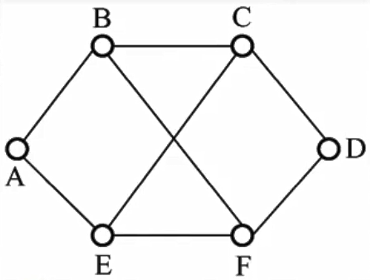

# 4.4 路由算法和路由协议

## 4.4.1 路由算法的分类

### 1、静态路由

非自适应路由算法（手动配置路由信息）

- 优点
  - 简单可靠
  - 适用于负荷稳定、拓扑变化不大的网络
- 缺点
  - 路由更新慢
  - 不适用于大网络

### 2、动态路由

自适应路由算法（路由器彼此交换信息，按照算法优化出路由表）

- 优点
  - 路由更新快
  - 适用于大型网络
  - 及时响应链路变化和网络拓扑变化
- 缺点
  - 算法复杂
  - 增加网络负担

#### （1）全局性

所有路由器掌握完整的网络拓扑和链路费用信息

应用：链路状态路由算法（OSPF）

#### （2）分散性

路由器仅掌握物理相联的邻居和链路费用

应用：距离向量算法（RIP）

## 4.4.2 层次路由

**自治系统AS**：在单一的技术管理下的一组路由器

- 这些路由器使用一种AS内部的路由选择协议和共同的度量以确定分组在该AS内的路由
- 同时还使用一种AS之间的路由协议以确定在AS之间的路由
- 一个AS内的所有网络都属于一个行政单位来管辖
- 一个自治系统的所有路由器在本自治系统内都必须连通

#### 意义

- 因特网规模很大，直接连接会导致路由表很大
- 不想让外界知道自己的路由选择协议，但还想连入因特网

#### 具体使用的协议

- **内部网关协议IGP**：AS内部使用的协议
  - RIP，OSPF
- **外部网关协议EGP**：AS之间使用的
  - BGP

## 4.4.3 RIP协议

RIP是一种分布式的基于<mark style="color:orange;">**距离向量**</mark>的路由选择协议，是因特网的协议标准，最大优点是简单

RIP协议要求网络中每一个路由器都维护从它自己到其他每一个目的网络的唯一**最佳距离记录**（即一组距离）

### 1、RIP路由表的结构

- **目的网络**
- **距离**
  - 跳数，即从源端口到目的端口所经过的路由器个数
  - 直接与路由器相联的网络距离为1
  - 最大允许路由器数量为15，因此<mark style="color:orange;">**距离为16表示网络不可达**</mark>
- **下一跳路由器**
  - 对于直连的网络，直接交付

### 2、RIP协议的信息交换

- 每一个路由器<mark style="color:orange;">**仅和相邻路由器交换**</mark>信息
- 路由器交换的信息是自己的<mark style="color:purple;">**路由表**</mark>
- 每30秒交换一次路由信息，然后路由器根据新信息更新路由表
  - 若超过180s没收到邻居路由器的通告，则判定邻居没了，并更新自己路由表，将包含邻居的路由信息删除
- 路由器之间通过<mark style="color:purple;">**RIP报文**</mark>交换路由表信息
  - RIP是<mark style="color:orange;">**应用层协议**</mark>
  - 一个RIP报文最多包含25个路由信息，多的表项需要分次发送
- 当时间足够后，路由器的路由表基本上包含本网络的所有路由信息，称为**收敛**

### 3、距离向量算法

假设路由器X发送了一条RIP报文到路由器A，则A处理RIP报文的逻辑如下：

1. 将RIP报文中的距离+1
2. 将RIP报文的下一跳路由器改为X
3. 检查本身路由表中是否包含相应目的网络
   - 存在目的网络，检查其下一跳地址
     - 是X，则用新收到的信息替换
     - 不是X，则与新收到的距离相比较，保留距离小的
   - 不存在目的网络
     - 将收到的信息填入路由表
4. 若180秒后还没收到X的更新路由表，则把X记为不可达的路由器，即把距离设置为16



例：考虑如图所示的子网，该子网使用了距离-向量算法，下面的向量刚刚到达路由器C：

- 来自B的向量为（5，0，8，12，6，2）
- 来自D的向量为（16，12，6，0，9，10）
- 来自E的向量为（7，6，3，9，0，4）

经过测量，C到B、D和E的延迟分别为6，3和5，那么C到达所有结点的最短路径是什么？

距离向量表示该路由器到其它各个路由器的距离，0表示本机。

将距离向量加上传输延迟即得到新的距离向量：

- C-B：（11，6，14，18，12，8）
- C-D：（19，15，9，3，12，13）
- C-E：（12，11，8，14，5，9）

将自己的对应向量修改位0，其它选最短，即得到最短路径：

（11，6，0，3，5，8）



**RIP协议好消息传得快，坏消息传得慢**，称为慢收敛

