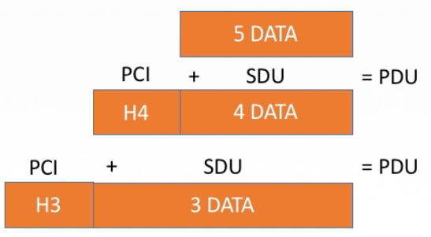

# 1.2 计算机网络体系结构与参考模型

## 1.2.1 计算机网络分层结构

### 1、相关概念

* **计算机网络体系结构**
  * 简称体系结构，从功能上描述计算机网络结构
  * 是分层结构
  * 每层遵守某些网络协议以完成基本功能
  * 是计算机网络各层及其协议的总和
* **实体**：每一层中的活动元素，第n层中的活动元素称为n层实体
* **对等实体**：位于同一层的实体
* **协议**：为进行网络中的对等实体数据交换而建立的规则、标准或约定称为网络协议。<mark style="color:orange;">**只有对等实体之间才存在协议**</mark>
* **协议的三要素**：
  * 语法：规定传输数据的格式（数据格式、起止方式等）
  * 语义：规定所要完成的功能（各分段的功能）
  * 同步：规定各种操作的顺序
* **接口（访问服务点SAP）**：上层使用下层服务的入口。
* **服务**：下层为相邻上层提供的功能调用

**SDU服务数据单元**：为完成用户所要求的功能而应传送的数据 

**PCI协议控制信息**：控制协议操作的信息

**PDU协议数据单元**：对等层次之间传送的数据单位


每一层的数据（SDU）加上控制信息（PCI）构成下一层所使用的SDU。


### 2、分层的基本原则

* 各层之间相互<mark style="color:orange;">**独立**</mark>，每层只实现一种相对独立的功能
* 每层之间<mark style="color:orange;">**界面自然清晰**</mark>，易于理解，相互交流尽可能少
* 结构上可分割开，每层都采用<mark style="color:orange;">**最合适的技术**</mark>来实现
* 保持下层对上层的独立性，<mark style="color:orange;">**上层单向使用下层提供的服务**</mark>
* 整个分层结构应该能促进标准化工作。
