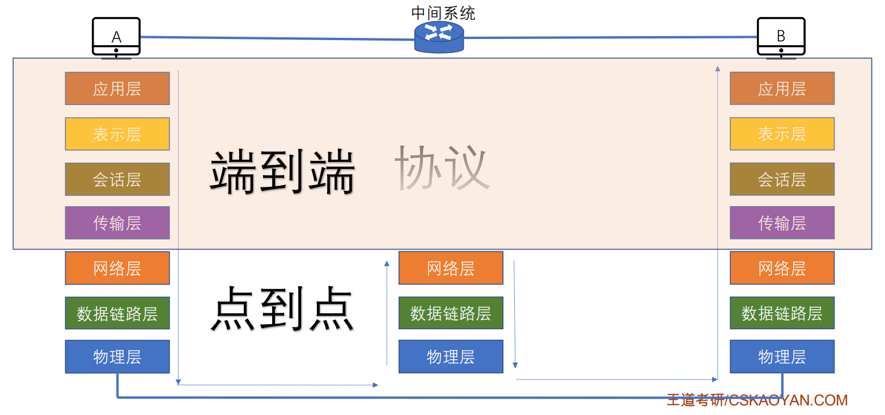

# 1.2 计算机网络体系结构与参考模型

## 1.2.1 计算机网络分层结构

### 1、相关概念

* **计算机网络体系结构**
  * 简称体系结构，从<mark style="color:orange;">**功能**</mark>上描述计算机网络结构
  * 是<mark style="color:orange;">**分层结构**</mark>，是抽象的
  * 每层遵守某些网络协议以完成基本功能
  * <mark style="color:purple;">**是计算机网络各层及其协议的总和**</mark>
* **实体**：每一层中的活动元素，第n层中的活动元素称为n层实体
* **对等实体**：位于同一层的实体
* **协议**：为进行网络中的对等实体数据交换而建立的规则、标准或约定称为网络协议。<mark style="color:orange;">**只有对等实体之间才存在协议**</mark>
* **协议的三要素**：
  * 语法：规定传输数据的格式（数据格式、起止方式等）
  * 语义：规定所要完成的功能（各分段的功能）
  * 同步：规定各种操作的顺序
* **接口（访问服务点SAP）**
  * 上层使用下层服务的入口
  * 只有相邻层之间存在接口，服务的实现细节对上层完全屏蔽
* **服务**
  * 下层为相邻上层提供的功能调用
  * 当某一层使用前一层提供的服务时，还包含下层所提供的所有服务

**SDU服务数据单元**：为完成用户所要求的功能而应传送的数据 

**PCI协议控制信息**：控制协议操作的信息

**PDU协议数据单元**：对等层次之间传送的数据单位


每一层的数据（SDU）加上控制信息（PCI）构成下一层所使用的SDU。


### 2、分层的基本原则

* 各层之间相互<mark style="color:orange;">**独立**</mark>，每层只实现一种相对独立的功能
* 每层之间<mark style="color:orange;">**界面自然清晰**</mark>，易于理解，相互交流尽可能少
* 结构上可分割开，每层都采用<mark style="color:orange;">**最合适的技术**</mark>来实现
* 保持下层对上层的独立性，<mark style="color:orange;">**上层单向使用下层提供的服务**</mark>
* 整个分层结构应该能促进标准化工作。

## 1.2.2 OSI参考模型

<mark style="color:purple;">**开放性系统互联参考模型**</mark>，通称OSI参考模型。

### 1、应用程

所有<mark style="color:orange;">**能和用户交互**</mark><mark style="color:red;">**产生网络流量**</mark>的<mark style="color:purple;">**程序**</mark>。

#### 应用层服务

* 文件传输（FTP）
* 电子邮件（SMTP）
* 万维网（HTTP）

### 2、表示层

用于处理在两个通信系统中交换信息的表示方式（语法和语义）。

#### 表示层功能

* 数据<mark style="color:orange;">**格式变换**</mark>
  * 比特流→JPG图片
* 数据<mark style="color:orange;">**加密解密**</mark>
* 数据<mark style="color:orange;">**压缩和恢复**</mark>
  * 对视频流进行压缩等

#### 表示层协议

* ASCII
* JEPG

### 3、会话层

向表示层实体/用户进程提供建立连接并在连接上有序地传输数据。
