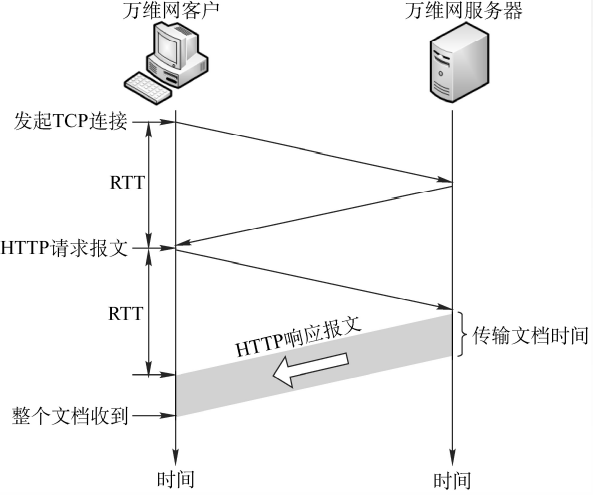
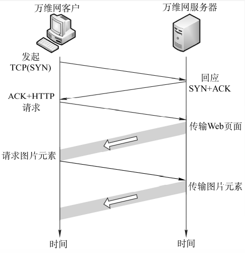
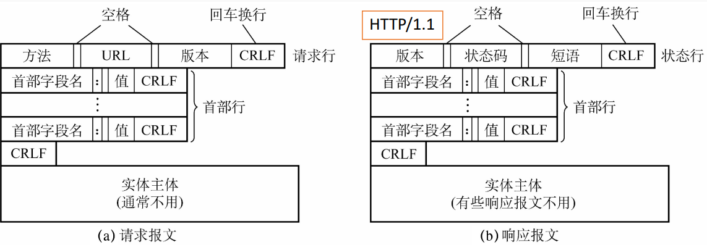

# 6.5 万维网

## 6.5.1 万维网概述

- 万维网是基于**C/S**的协议
- **统一资源定位符URL**：资源在万维网中的唯一标识
  - 组成方式：<协议>://<主机>:<端口>/<路径>
  - URL不区分大小写
- **超文本传输协议HTTP**
- **超文本标记语言HTML**

## 6.5.2 超文本传输协议HTTP

**HTTP定义了：**

- 浏览器（万维网客户进程）怎样向万维网服务器请求万维网文档
- 服务器怎样把文档传送给浏览器

### 1、HTTP连接过程

1. 浏览器分析URL
2. 浏览器向DNS请求解析IP地址
3. DNS解析出IP地址
4. 浏览器与服务器建立TCP连接
5. 浏览器发出取文件命令
6. 服务器响应
7. 释放TCP连接
8. 浏览器显示

### 2、HTTP协议的特点

- HTTP是**无状态**的
  - 每一次连接是一样的
  - 通过cookie识别用户，存储用户信息
- HTTP采用**TCP**作为传输层协议
  - HTTP是面向连接的：采用TCP协议
  - **HTTP本身是无连接的**：通信双方在交换HTTP报文之前不需要先建立HTTP连接

### 3、HTTP协议的连接方式

- **非持久连接**：每一次的传输都需要先进行HTTP握手
  - 传输时间为$$2\times \text{RTT}+文件传输时间$$
- **持久连接**：连接建立后会保持一段时间，可以继续传输后续的请求
  - **非流水线式连接**：类似停等协议，每一个请求按序发送
  - **流水线式连接**：类似GBN和SR协议，请求可以一起发送

### 4、HTTP报文结构

HTTP报文是**面向文本**的，因此在报文中的每一个字段都是一些ASCII码串

- 请求报文
  - 请求行
    - 方法：GET、SET等
    - URL
    - 版本：协议版本
    - 换行标志
  - 首部行：说明浏览器等的一些信息
- 响应报文
  - 状态行
    - 状态码+短语：404 NOT FOUND等
    - 换行标志
  - 首部行

