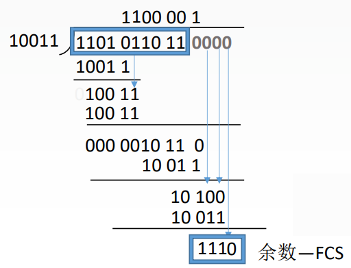

# 3.3 差错控制

## 3.3.1 差错的差生

差错基本上都是由于噪声引起的。

### 1、噪声的种类

- 全局性
  - 由于线路本身电气特性所产生的**随机噪声**（热噪声），是信道固有的，随机存在的
  - 解决方法：提高信噪比
- 局部性
  - 外界特定的短暂原因所造成的**冲击噪声**，是产生差错的**主要原因**
  - 解决办法：通常利用编码技术来解决

### 2、差错的种类

- **位错**：0变1、1变0
- **帧错**
  - 丢失：【1】【3】
  - 重复：【1】【2】【2】【3】
  - 失序：【1】【3】【2】

### 3、链路层提供的服务种类

对于通信质量好的网络，采用**无确认无连接服务**

对于通信质量差的网络，采用**有确认无连接服务**

对于无线传输链路，采用**有确认有连接服务**

## 3.3.2 检错编码

### 1、奇偶校验码

有n-1位数据位和1位校验位，使1的个数分别为奇数或者偶数，则称为采用了奇校验（偶校验）。

**缺点**：只能检查出奇数个的错误，检错能力为50%

### 2、循环冗余编码（CRC）

将数据拆分为相等大小的组，每一组加上冗余码（FCS）构成帧再发送。

冗余码采用生成多项式与数据相除得到，具体流程如下所示

> 例：要发送的数据是1101011011，采用CRC校验，生成多项式是10011，那么最终发送的数据应该是？
>
> 10011对应的多项式为：$x^4+0x^3+0x^2+x+x^0$，阶为4
>
> 将数据加上4位0，得到被除数：11010110110000
>
> 将被除数与生成多项式模二相除（异或，同0异1）
>
> 
>
> - 异或运算所得结果前面0省略，补足5位
> - 最后的余数即为FCS
>
> 因此输出结果为11010110111110
>

接收方在校验时，使用同样的生成多项式与数据相除，若余数为0，则表明数据无误，接收方接收信息。

否则，接收方会将这一帧**丢弃**。

> CRC能够实现无比特差错的传输，但不是**可靠传输**。
>
> 可靠传输：发送方发送什么，接收方就接收什么。
>

## 3.3.3 纠错编码

### 1、海明码

#### （1）海明距离

两个合法编码（码字）的对应**比特取值不同**的比特数称为这两个码字的**海明距离**（码距）

一个有效编码集中，任意两个合法编码（码字）的海明距离的**最小值**称为该编码集的**海明距离**（码距）

对于一个n位的数据

- 使用海明码进行**检错**，码距应为n+1
- 使用海明码进行**纠错**，码距应为2n+1

> 计算机网络考察中，海明码
>
> - **检错**：双比特
> - **纠错**：单比特
>

海明码的使用分为四步：

1. 确定校验码的位数
2. 确定校验码的位置
3. 求出校验码的值
4. 检错、纠错

#### （2）确定校验码的位数

若数据有m位，校验码有r位，则校验码的位数应满足：
$$
2^{r}\geq m+r+1
$$

#### （3）确定校验码和数据的位置

将校验码依次放在$2^{r}$位上，剩下的数据依次填入

#### （4）求出校验码的值

每位校验位依照自身序号中为1的位置确定所要检验的数据位

依据各校验码所对应的校验数据位，分别做偶校验，得到校验位的值

> 例：要发送的数据为1100
>
> m=4，满足条件的最小r=3，校验码有3位
>
> 确定校验码的位置：
>
> 
>
> 确定各校验码的值：
>
> 
>
> - $x_{1}$负责1、3、5、7位的校验，偶校验结果为1；
> - $x_{2}$负责2、3、6、7位的校验，偶校验结果为0；
> - $x_{4}$负责4、5、6、7位的校验，偶校验结果为0
>
> 综上，海明码结果为1100001
>

#### （5）检错和纠错

对各校验位进行奇偶校验，若为奇数，则证明数据出错。

将每位校验码所校验的位数再次求奇偶校验，得到新的结果转置所得的二进制值即为出错位数

> 例：上例中接收方收到1110001，进行检错纠错
>
> 首先分别求1的奇偶：
>
> - $$x_{1}$$：1、3、5、7位，奇数
> - $$x_{2}$$：2、3、6、7位，偶数
> - $$x_{4}$$：4、5、6、7位，奇数
>
> 数据有错，求错误位：
>
> - $$x_{1}$$：1、3、5、7位，1011，结果为1
> - $$x_{2}$$：2、3、6、7位，0011，结果为0
> - $$x_{4}$$：4、5、6、7位，0111，结果为1
>
> 转置，得101，十进制为5，即第五位出错。
>

