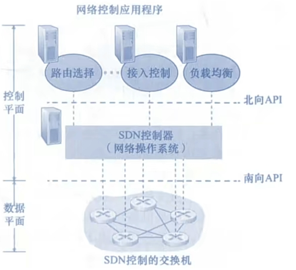
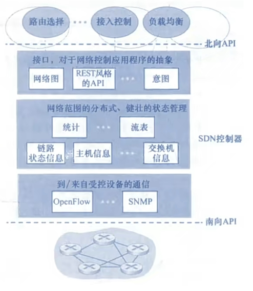

# 4.1 网络层的功能

主要任务是把分组从源端传到目的端，为分组交换网上的不同主机提供通信服务。

网络层传输单位是**数据报**。

当数据报过大时，还是会进行分组之后再发送。

网络层提供**不可靠服务**。

## 4.1.1 网络层的主要功能

- **分组转发**：达到路由器输入链路之一的数据如何转发到路由器的输出链路之一
- **路由选择**：控制数据报沿着从源主机到目的主机的端到端路径中传输的路由器之间的路由方式
- **异构网络互联**：物理层和数据链路层可以不同
- 拥塞控制
  - 开环控制
  - 闭环控制

## 4.1.2 SDN

### 一、网络层划分

可以将网络层抽象的划分为**数据平面**与**控制平面**

- **数据平面**：处理转发相关事宜
  - **特点**
    - 时间短
    - 路由器本地负责
    - 使用硬件解决
  - **功能**：根据转发表进行转发
- **控制平面**：处理路由选择相关事宜
  - **特点**
    - 时间长
    - 使用软件处理
  - **实现**
    - 传统方法：路由选择算法运行在每台路由器中，每台路由器中都包含转发和路由选择两种功能
      - 控制平面与数据平面在同一个路由器中进行
      - 通过与其他路由器通信计算出路由表和转发表
      - **路由选择控制器**负责执行控制平面功能
    - **SDN方法**

### 二、SDN方法

- **特点**
  - 控制平面从路由器物理上分离
  - 路由器仅实现转发
  - **远程控制器**计算和分发转发表以供各个路由器使用
  - 通过软件计算转发表
  - **路由选择控制器**负责与远程控制器通信，接收转发表
- **SDN控制平面的进一步划分**
  - **SDN控制器**
    - 维护准确的网络状态信息
    - 为网络控制应用程序提供这些信息
  - **网络控制应用程序**
    - 根据SDN控制器提供的信息，监视、编程和控制下面的网络设备

- **SDN控制器的进一步划分**
  - 对于网络控制应用程序的接口（北向API）
  - 网络范围状态管理层
  - 通信层（南向API）

