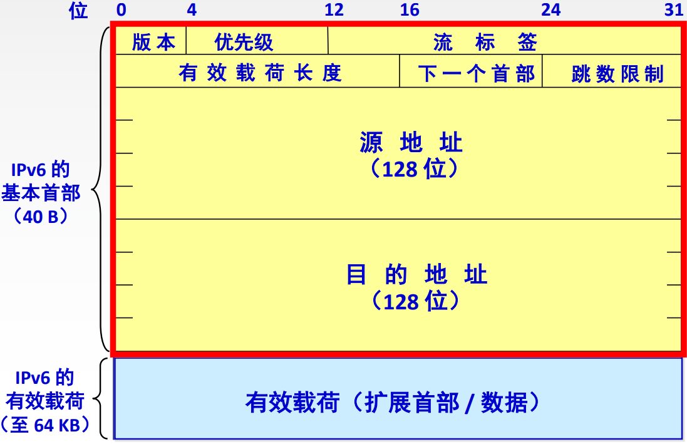

# 4.3 IPV6

## 4.3.1 IPV6数据报结构

- **首部**（固定40B）
  - **版本**：协议版本，IPV6
  - **优先级**：数据报的优先级
  - **流标签**：从特定源点到特定终点的一系列数据报称为一个“流”，属于同一个流的数据报拥有相同的流标签（类似IPV4的分组标签）
  - **有效载荷长度**：有效载荷部分的大小（扩展首部+数据部分）
  - **下一个首部**：标识下一个首部（扩展首部）
    - 每一个扩展首部中也有此字段
  - **跳数限制**：类似IPV4的TTL
  - **源地址、目的地址**：共计128位
- **有效载荷**（最大64KB，即$$64 \times 2^{10}\ \text{B}=65535\ \text{B}$$）
  - 包括原IPV4首部中的扩展首部部分

## 4.3.2 IPV4与IPV6

### 1、区别

- 地址：将地址长度从32位（4B）扩展到**128位**（16B）
- IPV6移除了校验和字段，减少每跳的处理时间
- IPv6将IPv4的可选字段移出首部，提高了路由器的处理效率
- IPv6支持即插即用（即自动配置），**不需要DHCP协议**
- IPv6首部长度必须是**8B的整数倍**，IPv4首部是4B的整数倍
- IPv6**只能在主机处分片**，IPv4可以在路由器和主机处分片
  - 通过ICMPv6差错报告报文报告数据报过大，主机重新分片
- IPv6取消了协议字段，改成下一个首部字段
- IPv6取消了总长度字段，改用有效载荷长度字段
- IPv6取消了服务类型字段
- IPv6支持资源的预分配

### 2、IPV4向IPV6过渡

- **双栈协议**：设备同时启用IPV4和IPV6协议栈
- **隧道技术**：设备使用**隧道协议**，隧道协议能够将其他协议的数据包**重新封装**并通过隧道发送

## 4.3.3 IPV6地址

### 1、IPV6地址的表示

一般形式：**4BF5:0000:0000:0000:BA5F:039A:000A:2176**

压缩形式：**4BF5:0:0:0:BA5F:39A:A:2176**（舍弃前面的0，每一位至少保留一位数字）

零压缩：**4BF5::BA5F:039A:000A:2176**（将连续的0用::表示）

> **零压缩在一个地址中只能使用一次**。
>

### 2、IPV6基本地址类型

- 单播
  - 一对一通信
  - 可做源地址+目的地址
- 多播
  - 一对多通信
  - 可做目的地址
- 任播
  - 一对多中的一个通信
  - 可做目的地址

