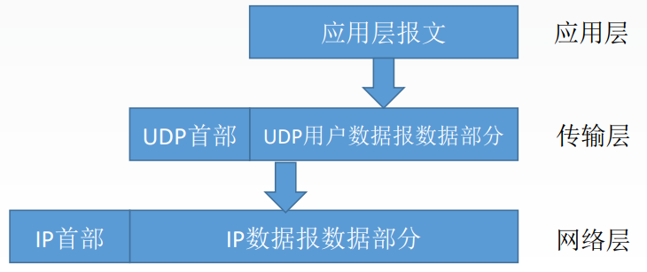
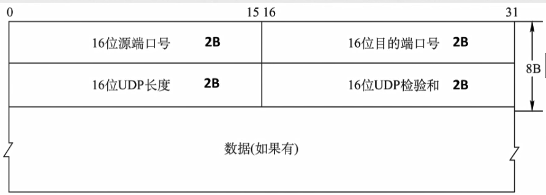
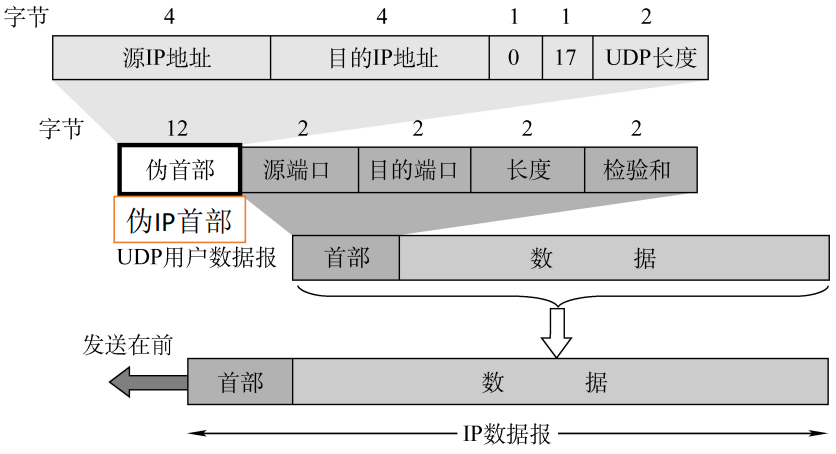
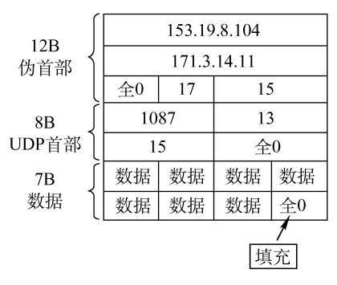

# 5.2 UDP协议

## 5.2.1 UDP数据报

### 1、UDP概述

UDP只在IP数据报服务之上增加了很少功能，即复用分用和差错检测功能。

#### UDP的主要特点

- UDP是<font color=orange>**无连接**</font>的
- UDP<font color=orange>**不保证可靠交付**</font>
- UDP是<font color=orange>**面向报文**</font>的，适合一次性传输少量数据的网络应用
- UDP无拥塞控制，适合很多实时应用
- UDP首部开销小


```admonish
**面向报文**：应用层给UDP多长的报文，UDP就照样发送，即一次发一个完整报文，不做处理


```


### 2、UDP首部格式



- **首部字段**
  - **源端口号**（16位，2B）：可选填，当需要目的主机回应时使用
  - **目的端口号**（16位，2B）：<font color=orange>**必要**</font>，目的进程的端口号
  - **UDP长度**（16位，2B）：整个UDP数据报的长度（首部字段+数据字段）
  - **UDP检验和**（16位，2B）：检测<font color=orange>**整个**</font>UDP数据报是否有错误
- **数据字段**


```admonish warning
分用时，找不到对应的目的端口号，就丢弃报文，并给发送方发送ICMP“端口不可达”差错报告报文
```


## 5.2.2 UDP校验

### 1、伪首部



**伪首部**：只有在<font color=orange>**计算检验和**</font>时才出现， 不向下传送也不向上递交

伪首部模仿的是IP数据报的首部：

- **源IP、目的IP**（4B）
- **0**（1B）：固定字段
- **17**（1B）：UDP的协议对应
- **UDP长度**（2B）：UDP首部8B+数据部分长度，<font color=orange>**不包括伪首部**</font>

### 2、校验过程

- 若不使用校验，则将校验和字段全部置0



- 发送方
  1. 加上伪首部
  2. 全0填充检验和字段
  3. 全0填充数据部分（使整个UDP数据报是4字节的整数倍）
  4. 将伪首部+首部+数据字段进行<font color=orange>**二进制反码求和**</font>
     - 以16bit（2B）为一组分开进行求和（校验和字段长度）
  5. 将求和结果填入检验和字段
     - 若结果恰好全为0，则全部填入1
  6. 去掉伪首部
  7. 发送
- 接收方
  1. 加上伪首部
  2. 将伪首部+首部+数据字段进行<font color=orange>**二进制反码求和**</font>
     - 结果全为1，则无差错
     - 否则视情况丢弃数据，或交给应用层并附上差错警告
