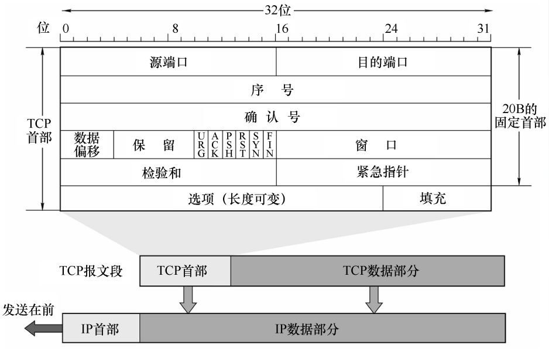
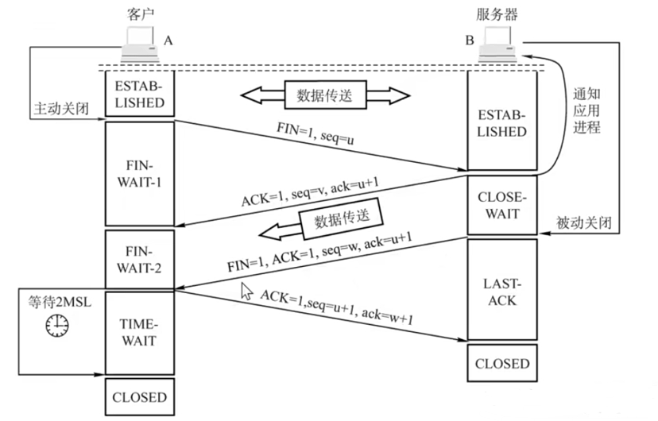
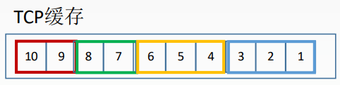
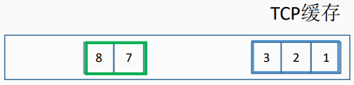
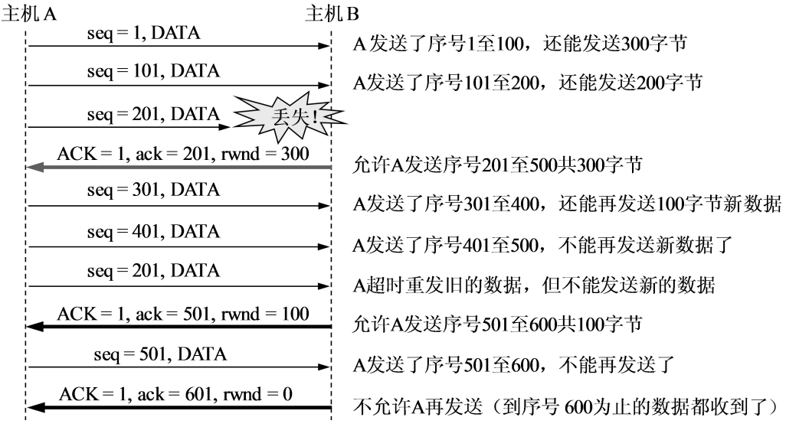
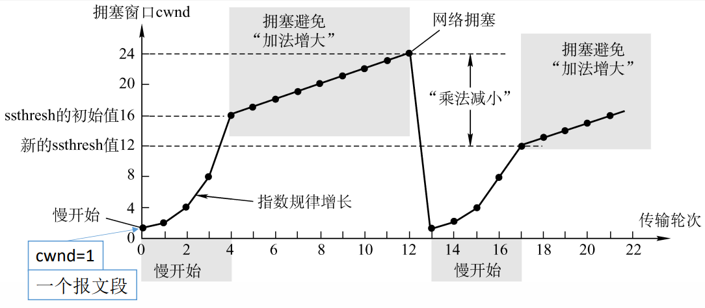
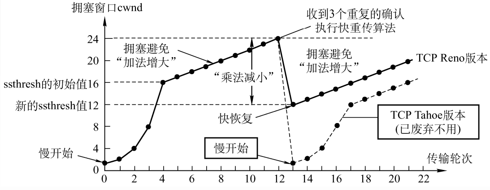

# 5.3 TCP协议

## 5.3.1 TCP协议的特点

- TCP是<font color=orange>**面向连接**</font>（虚连接）的传输层协议
  - 只有建立了连接才能开始通信
  - 连接是逻辑连接，不是实际链路
- 每一条TCP连接**只能有两个端点**，每一条TCP连接只能是点对点的
  - 无法用于广播等
- TCP提供<font color=orange>**可靠交付**</font>的服务，无差错、不丢失、不重复、按序到达
- TCP提供<font color=orange>**全双工通信**</font>
  - 发送缓存
    - 准备发送的数据
    - 已发送但尚未收到确认的数据
  - 接收缓存
    - 按序到达但尚未被接受应用程序读取的数据
    - 不按序到达的数据
- TCP<font color=orange>**面向字节流**</font>
  - TCP把应用程序交下来的数据看成仅仅是一连串的无结构的字节流
  - TCP将要传输的数据分成多个字节，以字节为单位传送

## 5.3.2 TCP报文段格式



- **源端口、目的端口**（16位，2B）
- **序号seq**（32位，4B）：此报文段中所发送数据的<font color=orange>**第一个字节**</font>的序号
  - 在一个TCP连接中传送的字节流中的每一个字节都按顺序编号
- **确认号ack**（32位，4B）：期望收到对方下一个报文段的<font color=orange>**第一个数据字节**</font>的序号
- **数据偏移**（4bit）：<font color=orange>**以4B为单位**</font>，表示首部长度，即数据部分从哪里开始
- **控制位**（1bit）
  - **紧急位URG**：为1时，表示该报文中有紧急数据，需要<font color=orange>**优先从TCP缓存队列中发送**</font>
  - **确认位ACK**：为1时，确认位才有效
  - **推送位PSH**：为1时，接收方尽快将消息交付到上层，不再等待缓冲区填满后才交付（与URG相对应）
  - **复位RST**：为1时，表示必须释放连接，然后再重新建立传输链接
  - **同步位SYN**：为1时，表示这个报文是一个连接建立的请求/接收报文
  - **终止位FIN**：为1时，表示此报文段发送方<font color=orange>**数据已发完**</font>，要求释放连接
- **窗口**（16位，2B）：<font color=orange>**单位为字节（B）**</font>，表示己方的接收窗口大小，即允许对方发送的数据量（$$0\sim 2^{16}-1$$）
- **检验和**（16位，2B）：与UDP类似
  - TCP的伪首部代表协议的字段为6
- **紧急指针**（16位，2B）：URG=1时才有意义，表明本报文中紧急数据的字节数
  - 紧急数据从0开始
  - 实际上指向的是紧急数据尾部的位置
- **选项**（长度可变）：最大报文段长度MSS、窗口扩大、时间戳、选择确认
- **填充**：使TCP首部长度为4B的整数倍

## 5.3.3 TCP连接管理


```admonish
TCP连接的建立采用客户服务器方式

主动发起连接建立的应用进程叫做**客户**，而被动等待连接建立的应用进程叫**服务器**
```


### 1、TCP连接的建立

1. 客户端发送<font color=purple>**连接请求报文段**</font>，无应用层数据
   - SYN=1
   - seq=x（随机产生）
   - ACK=0
   - ack无效
2. 服务器端为该TCP连接分配缓存和变量，并向客户端返回<font color=purple>**确认报文段**</font>，允许连接，无应用层数据
   - SYN=1
   - seq=y（随机）
   - ACK=1
   - ack=x+1
3. 客户端为该TCP连接分配缓存和变量，并向服务器端返回确认的确认，可以携带数据
   - SYN=0
   - seq=x+1
   - ACK=1
   - ack=y+1


```admonish
**SYN洪泛攻击**：一直发送第一次握手的SYN数据包，并不进行确认，导致服务器有大量挂起等待确认的TCP连接，消耗CPU和内存，进而导致死机

解决方法：SYN cookie
```


### 2、TCP连接释放


```admonish
参与一条TCP连接的两个进程中的**任何一个**都能终止该连接
```




1. 客户端发送<font color=purple>**连接释放报文段**</font>，停止发送数据，主动关闭TCP连接，转为<font color=purple>**FIN-WAIT-1**</font>状态
   - FIN=1
   - seq=u
2. 服务器端回送一个确认报文段，并转为<font color=purple>**CLOSE-WAIT**</font>状态；**客户到服务器**这个方向的连接就释放了（半关闭状态），客户端收到这个确认段后转为<font color=purple>**FIN-WAIT-2**</font>状态
   - ACK=1
   - seq=v
   - ack=u+1
3. 服务器端发完数据，就发出<font color=purple>**连接释放报文段**</font>，主动关闭TCP连接，转为<font color=purple>**LAST-ACK**</font>状态
   - FIN=1
   - seq=w
   - ACK=1
   - ack=u+1
4. 客户端回送一个确认报文段，转为<font color=purple>**TIME-WAIT**</font>状态，再等到时间等待计时器设置的2MSL（最长报文段寿命）后，连接彻底关闭
   - seq=u+1
   - ACK=1
   - ack=w+1

**2MSL的意义**：防止服务器端因为未收到客户端的确认报文段导致无法关闭

## 5.3.4 TCP可靠传输


```admonish
**可靠**：保证接收方进程从缓存区读出的字节流与发送方发出的字节流是完全一样的
```


### 1、校验

与UDP类似，通过伪首部进行检验和校验

### 2、序号

为传输流中的每一个字节进行编号，将缓冲区中的字节组成若干个TCP段（数据报），通过确认号和序号的机制进行发送

### 3、确认

接收方收到报文段后，返回确认字段，确认字段中的确认号为下一个期望收到的起始字节编号。

**捎带确认**：接收方将确认字段捎带在自己要发送的数据中（ACK=1，使用相应的确认号即可）

**累计确认**：只确认到**第一个丢失**为止的字节





- 此时接收方返回的确认号为4
- 7、8仍然正常接收
- 发送方重新发送4、5、6
- 接收方收到后返回的确认号为9

### 4、重传

**超时重传**：TCP的发送方在**规定的时间**（<font color=purple>**重传时间RTTs**</font>）内没有收到确认就要重传已发送的报文段，RTTs本质是<font color=orange>**加权平均往返时间**</font>

- 重传时间过短：太长的数据报来不及发送完毕
- 重传时间过长：增加网络空闲时间，降低传输效率

TCP采用自适应算法，<font color=orange>**动态改变**</font>重传时间RTTs

#### 冗余ACK（冗余确认）

每当比期望序号大的失序报文段到达时，发送一个<font color=purple>**冗余ACK**</font>，指明下一个期待字节的序号


```admonish example
例：发送方已发送1，2，3，4，5报文段

- 接收方收到1，返回给1的确认（ACK=2）
- 接收方收到3，返回给1的确认（ACK=2，冗余ACK）
- 接收方收到4，返回给1的确认（ACK=2，冗余ACK）
- 接收方收到5，返回给1的确认（ACK=2，冗余ACK）
- 发送方收到3个对于报文段1的冗余ACK
- 发送方认定2丢失，重传2
```


## 5.3.5 TCP流量控制

TCP利用**滑动窗口**机制实现流量控制。

接收方根据自己的缓冲区大小，动态的通过窗口字段调整发送方发送窗口的大小。

发送方窗口大小取<font color=purple>**接收窗口rwnd**</font>和<font color=purple>**拥塞窗口cwnd**</font>的<font color=orange>**最小值**</font>。

**拥塞窗口**：发送方根据自己估算的网络拥塞程度而设置的窗口值，反映网络当前容量

当接收方通过确认重传机制进行字节编号确认时，会连带着修改发送方的允许发送窗口大小


```admonish example
例：A向B发送数据，连接建立时，B的初始rwnd=400（B），设每一个报文段100B，报文段序号初始值为1


```


若接收方发送的允许发送的确认信息丢包，则此时会出现“死锁”情况，即发送方窗口大小仍然为0，无法发送数据；接收方一直等待发送方发送新数据，没有新的确认信息。

**解决方法**：TCP为每一个连接设有一个持续计时器，只要TCP连接的一方收到对方的零窗口通知，就启动持续计时器。到时间则发送一个<font color=orange>**零窗口**</font>的<font color=purple>**探测报文段**</font>，并重置计时器时间。


- **滑动窗口过小**：产生太多ACK
- **滑动窗口过大**：路由器发生拥挤，主机可能丢失分组

## 5.3.6 TCP拥塞控制

- 拥塞控制：**全局性**的控制
- 流量控制：端到端的控制

**拥塞控制的意义**：防止过多的数据注入到网络中


```admonish warning
**讨论前提**：

- 数据单方向传送，而另一个方向只传送确认
- 接收方总是有足够大的缓存空间（$\text{rwnd}\to \infty$），因而发送窗口大小取决于拥塞程度
```


### 1、慢开始和拥塞避免



- cwnd的<font color=orange>**单位是报文段**</font>
- 默认的初始值为1（或MSS长度）
- **传输轮次**：从发送一批报文段到收到它们的确认所用的时间，<font color=orange>**单位为往返时延RTT**</font>
- **慢开始**：cwnd的增加速度为指数型增长，起始为1
- **拥塞避免**：当cwnd的值打到<font color=purple>**慢开始门限ssthresh**</font>时，增长模式变为每次+1
- 网络发生拥塞
  - 将cwnd置为1，重新进入慢开始算法
  - 将ssthresh置为<font color=orange>**当前cwnd的一半**</font>，提前进入拥塞避免算法

### 2、快重传和快恢复



- **慢开始&拥塞恢复**：初始阶段与慢开始和拥塞避免类似
- **快重传**：采用<font color=purple>**冗余ACK**</font>机制，当收到3次连续的冗余ACK时执行快重传，重新发送丢失帧
- **快恢复**：当发送拥塞时，只需要将窗口降低到新的<font color=purple>**慢开始门限ssthresh**</font>，再次进入拥塞避免算法即可
  - 新的ssthresh为发生拥塞时cwnd的一半
  - 快恢复算法不用将cwnd降低到1

