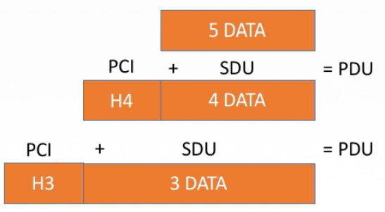
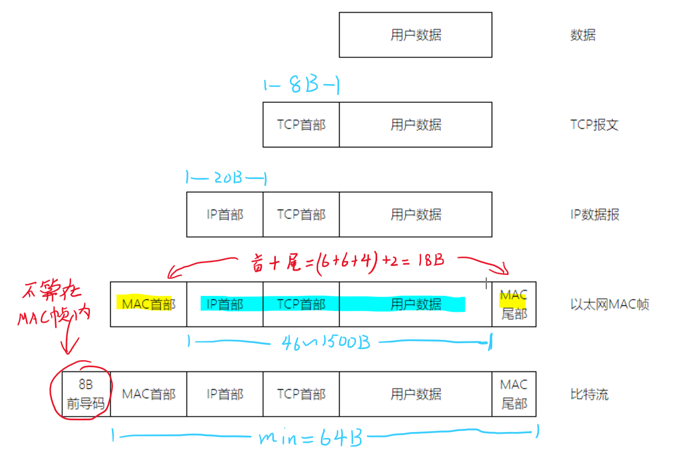
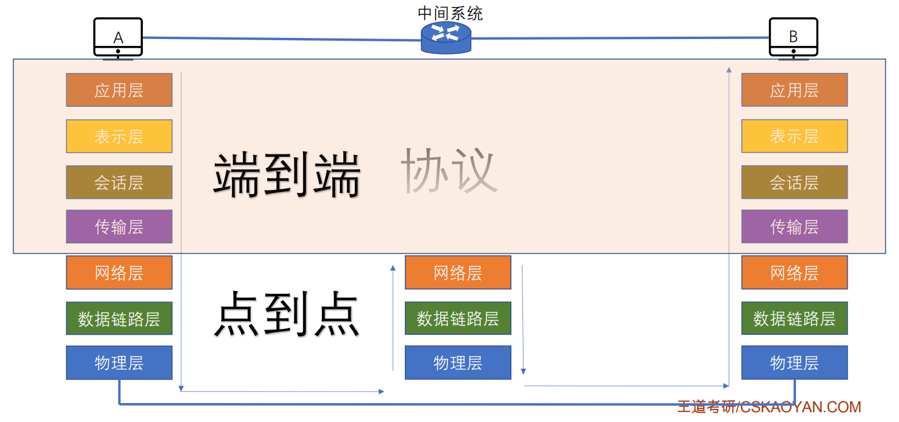
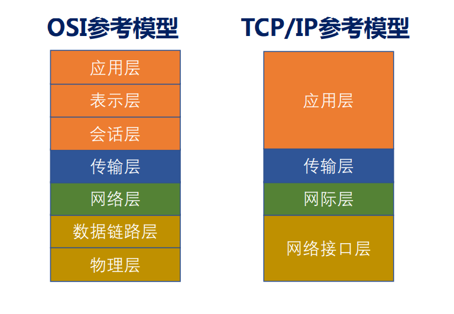
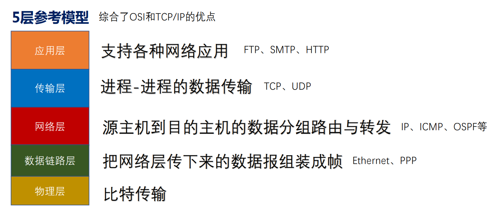
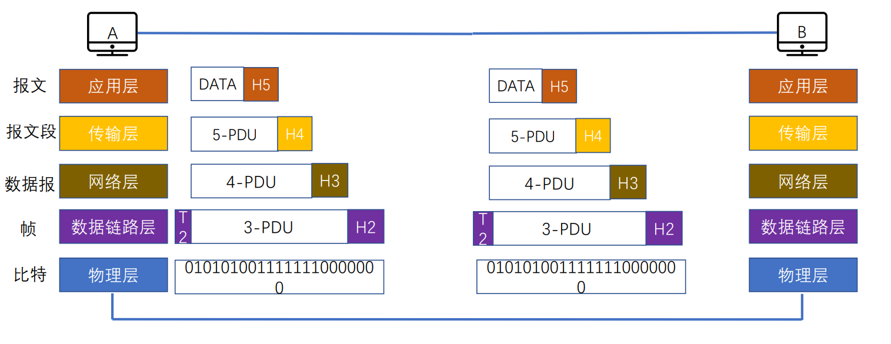

# 1.2 计算机网络体系结构与参考模型

## 1.2.1 计算机网络分层结构

### 1、相关概念

* **计算机网络体系结构**
  * 简称体系结构，从<font color=orange>**功能**</font>上描述计算机网络结构
  * 是<font color=orange>**分层结构**</font>，是抽象的
  * 每层遵守某些网络协议以完成基本功能
  * <font color=purple>**是计算机网络各层及其协议的总和**</font>
* **实体**：每一层中的活动元素，第n层中的活动元素称为n层实体
* **对等实体**：位于同一层的实体
* **协议**：为进行网络中的对等实体数据交换而建立的规则、标准或约定称为网络协议。<font color=orange>**只有对等实体之间才存在协议**</font>
* **协议的三要素**：
  * 语法：规定传输数据的格式（数据格式、起止方式等）
  * 语义：规定所要完成的功能（各分段的功能）
  * 同步：规定各种操作的顺序
* **接口（访问服务点SAP）**
  * 上层使用下层服务的入口
  * 只有相邻层之间存在接口，服务的实现细节对上层完全屏蔽
* **服务**
  * 下层为相邻上层提供的功能调用
  * 当某一层使用前一层提供的服务时，还包含下层所提供的所有服务



**SDU服务数据单元**：为完成用户所要求的功能而应传送的数据 

**PCI协议控制信息**：控制协议操作的信息

**PDU协议数据单元**：对等层次之间传送的数据单位


```admonish warning
每一层的数据（SDU）加上控制信息（PCI）构成下一层所使用的SDU。
```




### 2、分层的基本原则

* 各层之间相互<font color=orange>**独立**</font>，每层只实现一种相对独立的功能
* 每层之间<font color=orange>**界面自然清晰**</font>，易于理解，相互交流尽可能少
* 结构上可分割开，每层都采用<font color=orange>**最合适的技术**</font>来实现
* 保持下层对上层的独立性，<font color=orange>**上层单向使用下层提供的服务**</font>
* 整个分层结构应该能促进标准化工作。

## 1.2.2 OSI参考模型

<font color=purple>**开放性系统互联参考模型**</font>，通称OSI参考模型。




```admonish warning
应用层、表示层、会话层属于**资源子网**

网络层、数据链路层、物理层属于**通信子网**

传输层连接资源子网与通信子网
```


### 1、应用程

所有<font color=orange>**能和用户交互**</font><font color=red>**产生网络流量**</font>的<font color=purple>**程序**</font>。

#### 应用层服务

* 文件传输（FTP）
* 电子邮件（SMTP）
* 万维网（HTTP）

### 2、表示层

用于处理在两个通信系统中交换信息的表示方式（语法和语义）。

#### 表示层功能

* 数据<font color=orange>**格式变换**</font>
  * 比特流→JPG图片
* 数据<font color=orange>**加密解密**</font>
* 数据<font color=orange>**压缩和恢复**</font>
  * 对视频流进行压缩等

#### 表示层协议

* ASCII
* JEPG

### 3、会话层

向表示层实体/用户进程提供<font color=orange>**建立连接**</font>并在连接上<font color=orange>**有序**</font>地<font color=purple>**传输数据**</font>。

#### 会话层功能

* 建立、管理、终止会话
* 使用<font color=orange>**校验点**</font>可使会话在通信失效时从校验点/同步点继续<font color=purple>**恢复通信**</font>，实现数据同步

#### 会话层协议

* ASP
* ADSP

### 4、传输层

负责主机中<font color=orange>**两个进程**</font>的<font color=purple>**通信**</font>，即<font color=orange>**端到端**</font>的通信。

传输单位是<font color=purple>**报文段**</font>或<font color=purple>**用户数据报**</font>。

#### 传输层的功能

* **可靠传输、不可靠传输**
* **差错控制**：修正报文中的顺序错误、缺失等
* **流量控制**：依据收包速度控制发送方的发包速度
* **复用分用**
  * **复用**：多个应用层进程可以同时使用下层的服务
  * **分用**：传输层把收到的数据分别发送给上层相应的进程

#### 传输层协议

* TCP
* UDP

### 5、网络层

主要任务是把<font color=purple>**分组**</font>从源端传到目的端，为分组交换网上的不同主机提供通信服务。

网络层传输单位是<font color=purple>**数据报**</font>。

#### 网络层功能

* **路由选择**
* **流量控制**：限制发送方的速度
* **差错控制**：奇偶校验等
* **拥塞控制**：统筹整个网络中所有结点，防止发生拥塞

#### 网络层协议

* IP
* IPX
* ICMP
* IGMP
* ARP
* RARP
* OSPF

### 6、数据链路层

主要任务是把网络层传下来的数据报<font color=orange>**组装成帧**</font>。 

数据链路层/链路层的传输单位是<font color=purple>**帧**</font>。

#### 数据链路层功能

* **成帧**：定义帧的开始和结束
* **差错控制**：帧错+位错
* **流量控制**：限制发送方数据
* **访问（接入）控制**：控制对信道的访问

#### 数据链路层协议

* SDLC
* HDLC
* PPP
* STP

### 7、物理层

主要任务是在物理媒体上实现比特流的<font color=orange>**透明传输**</font>。 

物理层传输单位是<font color=purple>**比特**</font>。


```admonish
透明传输：不管所传数据是什么样的比特组合，都应当能够在链路上传送
```


#### 物理层功能

* **定义接口特性**
* **定义传输模式**：单工、双工、半双工
* **定义传输速率**
* **比特同步**
* **比特编码**

#### **物理层协议**

* Rj45
* 802.3

## 1.2.3 TCP/IP参考模型



### 1、TCP/IP与OSI模型的异同

* **相同**
  * 都分层
  * 基于独立的协议栈的概念
  * 可以实现异构网络互联
* **不同**
  * OSI定义三点：服务、协议、接口
  * OSI先出现，**参考模型先于协议发明**，不偏向特定协议
  * TCP/IP设计之初就考虑到异构网互联问题，将IP作为重要层次
  * 连接方式不同：

|  分层 |  OSI参考模型 | TCP/IP模型 |
| :-: | :------: | :------: |
| 网络层 | 无连接+面向连接 |    无连接   |
| 传输层 |   面向连接   | 无连接+面向连接 |

```admonish
**面向连接**分为三个阶段

1. 第一是建立连接，在此阶段，发出一个建立连接的请求。
2. 只有在连接成功建立之后，才能开始数据传输，这是第二阶段。
3. 接着，当数据传输完毕，必须释放连接。


**面向无连接**没有这么多阶段, 它直接进行数据传输。
```


### 2、五层参考模型

将OSI参考模型与TCP/IP协议综合，得到5层参考模型。



5层参考模型的数据封装流程如下图所示


